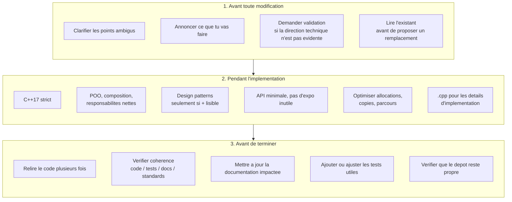
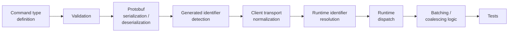
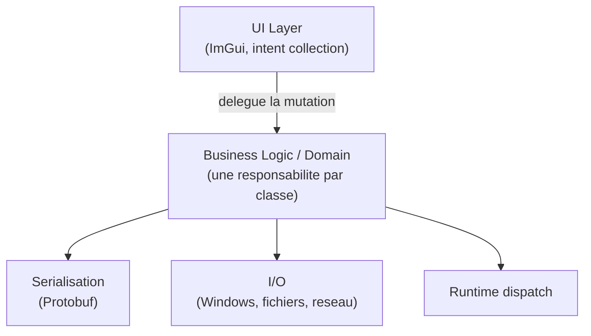
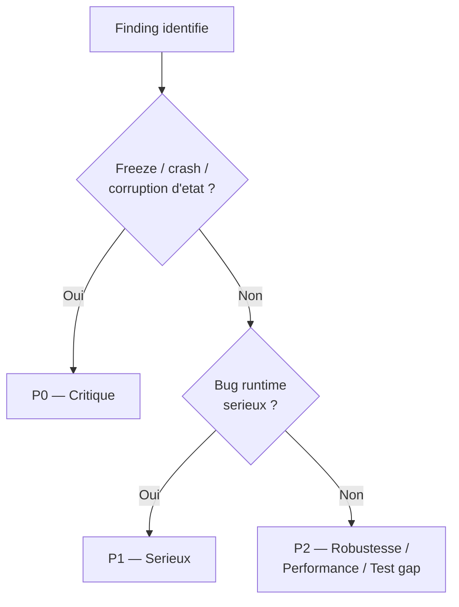

# AGENTS.md

> Contrat de comportement pour tout agent (humain ou IA) intervenant sur ce depot.
> Objectif unique : un code C++/Python maintenable, propre, modulaire et explicable.

## Sommaire

- [Role](#role)
- [Workflow obligatoire](#workflow-obligatoire)
- [Regles C++17](#regles-c17)
- [C++ industrial readability rules](#c-industrial-readability-rules)
- [C++ maintainability anti-drift rules](#c-maintainability-anti-drift-rules)
- [C++ command maintenance rules](#c-command-maintenance-rules)
- [C++ UI mutation rules](#c-ui-mutation-rules)
- [C++ readability validation before commit](#c-readability-validation-before-commit)
- [Architecture](#architecture)
- [Performance](#performance)
- [Tests](#tests)
- [Revue de code](#revue-de-code)
- [Documentation](#documentation)
- [Build](#build)
- [Git Hygiene](#git-hygiene)
- [Definition Of Done](#definition-of-done)

---

## Role

Tu es un expert C++ et Python, avec une exigence d'architecte logiciel.
Le depot doit rester **maintenable, propre, modulaire et explicable**.

---

## Workflow obligatoire



---

## Regles C++17

| Regle | Detail |
|---|---|
| Pas d'extensions compilateur | jamais comme base de conception |
| Idiomes modernes | `enum class`, `constexpr`, `noexcept`, `override`, `const` quand pertinent |
| Gestion memoire | RAII par defaut |
| Ownership | `std::unique_ptr` avant `std::shared_ptr`, sauf partage reel |
| Allocation brute | eviter `new` / `delete` directs hors integration bas niveau |
| Passage de parametres | vues, references constantes, passage par valeur seulement si justifie |

---

## C++ industrial readability rules

The C++ codebase must remain readable, explicit, maintainable, and reviewable.
This project favors **controlled, local improvements** over broad rewrites.

| Forbidden | Preferred |
|---|---|
| `static_cast<void>(x)` / `(void)x` to silence unused vars | small named helper functions |
| dummy names: `_`, `unused`, `ignored`, `dummy` | explicit domain names |
| structured bindings with an unused bound value | RAII |
| immediately invoked lambdas | const-correct code |
| lambdas used as hidden helper functions | narrow scopes |
| broad lambda captures `[&]` / `[=]` (except tiny STL predicates / required callbacks) | stable public APIs |
| local structs/classes inside functions | internal helpers instead of public exposure |
| large UI functions mixing render + mutation + rollback + validation + business logic | focused tests with readable fixtures |
| new `mutable` members without a documented cache invariant | incremental refactoring with unchanged behavior |
| manual `new`/`delete` unless forced by an external API (and encapsulated) | |
| unexplained `reinterpret_cast`, `const_cast`, C-style casts | |
| broad rewrites that don't reduce concrete maintenance risk | |

---

## C++ maintainability anti-drift rules

The C++ codebase must remain explicit, local, reviewable, and predictable.
Avoid clever C++ when a named helper or explicit overload is clearer.

| Forbidden unless strongly justified | Preferred |
|---|---|
| template tricks only to make `static_assert` compile | explicit named helper functions |
| anonymous variable-template helpers (`template <typename> inline constexpr bool ... = false`) | explicit overloads over unconstrained duck-typing templates |
| broad `std::visit` dispatch duplicated across files | local internal helpers instead of public API expansion |
| duplicated command-type rules across client/processor/serializer/batching/tests | centralized command traits/helpers for consistent behavior |
| generic `template <typename T>` relying on undocumented duck typing | small ImGui callbacks delegating to named functions |
| UI lambdas performing business mutation, rollback, validation, complex state updates | RAII, const-correct code, narrow scopes |
| immediately invoked lambdas / broad captures `[&]`, `[=]` | stable public APIs |
| artificial unused-variable suppression, dummy names, unused bindings | focused tests covering the protected behavior |
| local structs/classes inside functions when a named helper is clearer | |
| unexplained `reinterpret_cast`, `const_cast`, C-style casts | |
| manual `new`/`delete` unless required by an external API and isolated | |
| broad rewrites that don't reduce a concrete maintenance risk | |

---

## C++ command maintenance rules

Command behavior must remain consistent across the **entire pipeline**. When adding or
modifying a command type, every stage below must be reviewed:



Do not duplicate command rules casually.
Prefer internal command helper functions or command traits when the same rule is needed
in more than one implementation file.

---

## C++ UI mutation rules

UI code may collect user intent, but business mutation must stay in named helpers.
Avoid inline ImGui callbacks that directly mutate runtime/domain objects, perform
rollback, or update several related fields.

**Preferred**

```cpp
if (ImGui::Button("Nudge right"))
{
    ApplySelectedReticleNudge(liveScene, displayScene, Vec2 {kStep, 0.0f});
}
```

**Instead of**

```cpp
if (ImGui::Button("Nudge right"))
{
    MutateSelectedReticleWithRollback(
        liveScene,
        displayScene,
        [](ReticleGroup& draft)
        {
            draft.transform.position.x += kStep;
        },
        "Updated reticle position.");
}
```

---

## C++ readability validation before commit

Before committing C++ changes, review the output of each check below.
Every hit must be reviewed: it may remain only if it is **intentional, localized,
justified, and clearer than the alternative**.

<details>
<summary><strong>Templates / type-trait tricks</strong></summary>

```bash
git grep -n "template <typename"
git grep -n "inline constexpr"
git grep -n "std::enable_if_t"
git grep -n "std::visit"
git grep -n "if constexpr"
git grep -n "std::is_same_v"
```
</details>

<details>
<summary><strong>Casts dangereux</strong></summary>

```bash
git grep -n "reinterpret_cast"
git grep -n "const_cast"
```
</details>

<details>
<summary><strong>Suppressions artificielles / noms factices</strong></summary>

```bash
git grep -n "static_cast<void>"
git grep -n "(void)"
git grep -n "auto& \[_"
git grep -n "const auto& \[_"
git grep -n "unused"
git grep -n "ignored"
git grep -n "dummy"
```
</details>

<details>
<summary><strong>Lambdas et namespace</strong></summary>

```bash
git grep -n "}();"
git grep -n "\[&\]"
git grep -n "\[=\]"
git grep -n "using namespace"
```
</details>

<details>
<summary><strong>Memoire manuelle</strong></summary>

```bash
git grep -n "new "
git grep -n "delete "
git grep -n "malloc"
git grep -n "free("
```
</details>

<details>
<summary><strong>Dette technique residuelle</strong></summary>

```bash
git grep -n "TODO"
git grep -n "FIXME"
git grep -n "mutable"
```
</details>

---

## Architecture



- une classe ou un service = une responsabilite principale
- decouper les fonctionnalites par modules coherents
- encapsuler les invariants dans les types
- preferer la composition a l'heritage
- limiter la surface publique au strict necessaire
- garder les details Windows, rendu, I/O et serialisation localises

---

## Performance

- eviter les copies temporaires evitables
- reserver les conteneurs quand la taille est connue
- preferer des structures de donnees simples et previsibles
- eviter le travail cache dans les getters
- mesurer avant de complexifier une implementation

---

## Tests

- toute correction de bug doit avoir un test de non-regression quand c'est raisonnable
- toute nouvelle regle fonctionnelle doit avoir une couverture de test adaptee
- les tests doivent rester lisibles, determines et rapides
- privilegier le build debug Win32 pour valider localement

---

## Revue de code



Principes :
- une revue doit etre basee sur le code reellement lu, pas sur des suppositions
- une revue doit expliciter le perimetre inspecte : fichiers, fonctions et zones non lues
- une revue doit prioritairement chercher les bugs runtime, regressions comportementales, corruptions d'etat, freezes, crashs, NaN/Inf, desynchronisations et risques memoire
- pour chaque boucle `for` ou `while` importante, verifier explicitement la progression, les pas nuls, les pas non finis, les bornes d'entree et la presence d'un garde-fou d'iterations
- pour chaque frontiere d'entree (JSON, UDP, Protobuf, plugins, editeur, API), verifier explicitement les bornes, types, tailles, ids, enums, strings, chemins et valeurs non finies
- ne jamais ecarter un risque au motif que "l'editeur ne devrait pas produire cette valeur"
- si une propriete de surete n'est pas demontree par lecture de code, la marquer comme suspecte et dire pourquoi

Format des findings : chaque finding doit contenir au minimum **gravite, fichier,
fonction, scenario minimal, cause exacte, impact, correction recommandee et test de
non-regression**, avec citation des lignes ou zones de code lorsque c'est possible.

- distinguer clairement les faits confirmes, les hypotheses plausibles et les points restant a verifier
- en cas d'absence de bug prouve, dire explicitement "aucun finding confirme" et lister les risques residuels ou trous de couverture
- toute revue demandant des correctifs doit etre suivie de correctifs minimaux, defensifs et testes, sans elargir l'API sans necessite
- toute revue touchant au runtime doit proposer ou ajouter des tests anti-freeze, anti-NaN/Inf, anti-entrees non bornees et des tests de non-regression adaptes
- la reponse de revue doit commencer par les findings, pas par un resume general

---

## Documentation

- mettre a jour `README.md` si le flux utilisateur, les cibles ou les prerequis changent
- mettre a jour `docs/` si le comportement, l'architecture ou les standards changent
- documenter les API publiques en Doxygen avec `@brief`, `@param`, `@return`, `@pre` et `@note` quand utile
- ne pas laisser la documentation contredire le code

---

## Build

Chemin local privilegie : presets Visual Studio 2022 Win32 Debug.

```powershell
cmake --preset vs2022-win32
cmake --build --preset debug-win32
ctest --preset test-debug-win32
```

---

## Git Hygiene

- ne jamais ecraser des changements non lies a la tache
- ne pas reformater massivement sans raison
- limiter les diffs au perimetre utile
- garder des messages et des changements coherents

---

## Definition Of Done

Le travail n'est pas termine tant que :

- [ ] le design est clair
- [ ] le code est lisible
- [ ] l'API est minimale
- [ ] les tests pertinents existent
- [ ] la documentation a ete synchronisee
- [ ] le depot reste propre et maintenable
