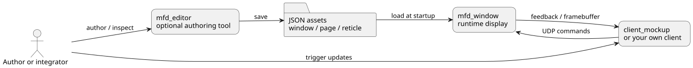
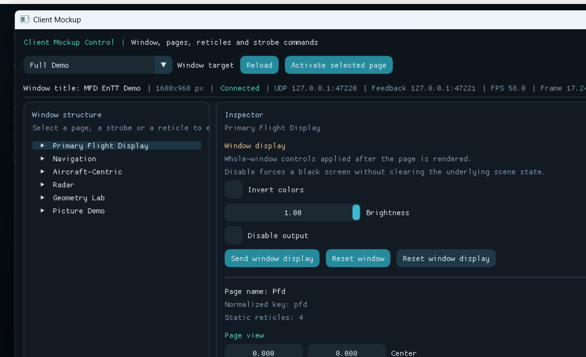
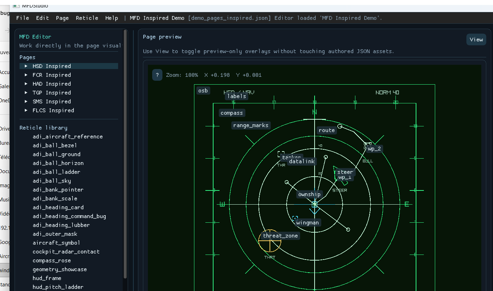
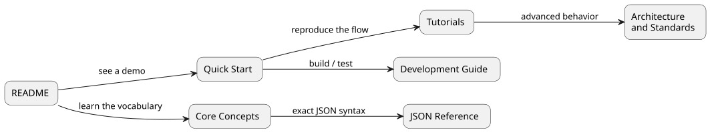

# MFDStudio

`MFDStudio` is a C++17 / CMake toolkit for authoring and operating 2D
multi-function display windows from JSON.

In the codebase, the historical technical prefix remains `mfd`
(namespaces, targets, folders, and APIs).


## What It Gives You

- author windows, pages, and reticle libraries in JSON
- edit those assets visually in `mfd_editor`
- run them in `mfd_window`
- drive the live runtime from `client_mockup` or your own UDP client
- capture the rendered window through a stable `RGBA32` framebuffer plugin ABI
- generate typed client-side C++ helpers for one authored window
- inspect the live runtime with the integrated `F1` debug overlay

## The 30-Second Mental Model



- the assets define what exists
- `mfd_window` renders the active page
- a client sends live commands over UDP
- the runtime can send feedback back to the client

## Start In 5 Minutes

Build the minimum useful set on Windows:

```powershell
cmake --preset vs2022-win32
cmake --build --preset debug-win32 --target mfd_window mfd_framebuffer_stdout_plugin client_mockup mfd_editor
```

Then:

1. launch `.\Scripts\Start-MfdDemo.bat` or `.\Scripts\Start-MfdCockpit.bat`
2. launch `client_mockup`
3. activate a page and change one reticle
4. press `F1` in `mfd_window`

If you want the guided version, go straight to [Quick Start](./docs/QUICKSTART.md).

## One Project, Three Main Apps

### Runtime Window

Use `mfd_window` when you want to render one authored window and drive it live.


### Live Client

Use `client_mockup` when you want to validate the UDP control loop without
writing your own client first.



### Visual Authoring

Use `mfd_editor` when you want to create or edit assets directly instead of
starting from handwritten JSON.



In the page inspector, runtime page layers, dynamic reticle bindings, and the
optional strobe stay separated explicitly: choose a template, assign one page
layer, add it to the page dynamic list, then adjust or remove that binding from
the same place.

## Read The Right Documentation



| Goal | Open first | Then |
| --- | --- | --- |
| See something working quickly | [Quick Start](./docs/QUICKSTART.md) | [Test A Window With The Mockup](./docs/tutorials/03_test_with_mfd_mockup.md) |
| Understand the vocabulary | [Core Concepts](./docs/CONCEPTS.md) | [Tutorial Index](./docs/tutorials/README.md) |
| Create assets in JSON | [Core Concepts](./docs/CONCEPTS.md) | [JSON Reference](./docs/reference/README.md) |
| Work visually in the editor | [Quick Start](./docs/QUICKSTART.md) | [Create A Window From Scratch In `mfd_editor`](./docs/tutorials/13_create_window_from_editor.md) |
| Integrate a live client | [Quick Start](./docs/QUICKSTART.md) | [Drive A Window From A Live Client](./docs/tutorials/04_drive_a_window_from_a_live_client.md) |
| Use the generated client API | [Use The Mockup As A Client API Reference](./docs/tutorials/11_use_the_mockup_as_a_client_api_reference.md) | [Generated Client API Standardization](./docs/standards/mfd_generated_client_api_standardization.md) |
| Build or contribute to the repo | [Development Guide](./docs/DEVELOPMENT.md) | [MFDStudio C++ Repository Maintenance Standard](./docs/standards/mfd_cpp_repository_maintenance_standard.md), [Run The Automated Runtime Tests](./docs/tutorials/12_run_the_automated_runtime_tests.md) |
| Answer one practical usage question quickly | [FAQ](./docs/FAQ.md) | [Documentation Guide](./docs/README.md) |
| See the current highlights of the tree | [What's New](./docs/WHATS_NEW.md) | [Documentation Guide](./docs/README.md) |

The documentation hub is [docs/README.md](./docs/README.md).

Useful companion pages:

- [FAQ](./docs/FAQ.md)
- [What's New](./docs/WHATS_NEW.md)

## Shipped Entry Points

| Entry point | Purpose |
| --- | --- |
| `mfd_window` | Generic runtime launcher that accepts a window JSON file |
| `Scripts/Start-MfdDemo.bat` | Launch the full repository demo window |
| `Scripts/Start-MfdCockpit.bat` | Launch the cockpit showcase |
| `Scripts/Start-MfdMinimal.bat` | Launch the minimal radar demo with the sample framebuffer plugin |
| `client_mockup` | Live UDP client for pages, reticles, strobe, feedback, and radar stress tests |
| `client_mockup_minimal` | Minimal plain-loop client for the cockpit showcase |
| `mfd_editor` | Visual authoring tool for windows, pages, and reticles |
| `mfd_framebuffer_stdout_plugin` | Sample stable framebuffer plugin for `mfd_window` |

## Repository Layout

| Path | Role |
| --- | --- |
| `assets` | Window, page, reticle, and image assets |
| `docs` | Onboarding, tutorials, reference, standards, and architecture notes |
| `examples` | Example clients and sample plugins |
| `mfd_common_api` | Shared low-level authored-model and transport layer |
| `mfd_api` | JSON loading, runtime, and public low-level API |
| `mfd_client_api` | Higher-level client helpers and generated client integration |
| `mfd_editor` | Editor application |
| `mfd_window` | Runtime host |
| `tests` | Automated test suites |

## Documentation Assets

The repo now keeps the visual documentation assets in source control:

- PlantUML sources under [docs/images](./docs/images/README.md)
- rendered SVG diagrams for GitHub and Doxygen
- captured GUI screenshots of the real Windows executables

Useful helper scripts:

```powershell
.\docs\RenderPlantUmlDiagrams.ps1
.\docs\CaptureScreenshots.ps1
```

## Build And Test

For day-to-day work on Windows, prefer the Win32 debug flow:

```powershell
cmake --preset vs2022-win32
cmake --build --preset debug-win32
ctest --preset test-debug-win32
```

The Visual Studio 2022 presets are pinned to the `v142` MSVC toolset so local
builds, staged `_Exec/` outputs, and delivery packages stay aligned.

Generate delivery packages with the dedicated script:

```powershell
.\Scripts\BuildDeliveries.bat
```

That command rebuilds the Win32/x64 Debug/Release package payloads and writes
the resulting SDK and install layouts under `_Deliveries/` without replacing
the local runtime staging flow under `_Exec/`.

Contributor-oriented details live in [Development Guide](./docs/DEVELOPMENT.md).

## Licenses

- project license: [LICENSE](./LICENSE)
- third-party notices: [THIRD_PARTY_NOTICES.md](./THIRD_PARTY_NOTICES.md)
