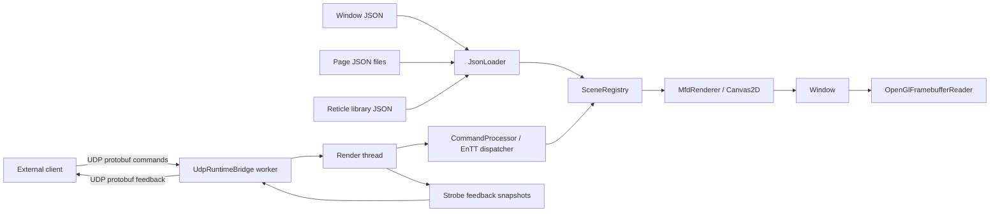

# MFD

`MFD` is a C++/CMake toolkit for building 2D multi-function display windows.

It combines:

- `raylib`
- `ImGui`
- `rlImGui`
- `EnTT`
- `nlohmann_json`
- Protocol Buffers over UDP for runtime control

The project is built around one simple workflow:

1. describe a window, its pages, and reusable reticles in JSON
2. render the active page in 2D
3. drive the window locally or from an external client
4. receive strobe feedback and framebuffer readback when needed

Automated runtime and JSON-loading checks are also built with the project
through `GoogleTest`.

## Start Here

If you are new to the project, use this order:

1. [Quick Start](./docs/QUICKSTART.md)
2. [Core Concepts](./docs/CONCEPTS.md)
3. [JSON Reference](./docs/reference/README.md)
4. [Tutorial Index](./docs/tutorials/README.md)

If you already know what you want:

- create reticles: [01 Create Reticles From Primitives](./docs/tutorials/01_create_reticles_from_primitives.md)
- create pages and windows: [02 Create Pages And Windows](./docs/tutorials/02_create_pages_and_windows.md)
- test without writing code: [03 Test A Window With The Mockup](./docs/tutorials/03_test_with_mfd_mockup.md)
- drive a window from an external app: [04 Drive A Window From A Live Client Over UDP](./docs/tutorials/04_drive_a_window_from_a_live_client.md)
- add and remove tracks or symbols at runtime: [05 Dynamic Reticles](./docs/tutorials/05_dynamic_reticles.md)
- use strobe control and feedback: [06 Strobe Control And Feedback](./docs/tutorials/06_strobe_control_and_feedback.md)
- capture the framebuffer as RGBA32: [07 Framebuffer RGBA32 Capture](./docs/tutorials/07_framebuffer_rgba32_capture.md)
- project nautical-mile and radian data to page space on the client: [08 Project User Space To Page Space](./docs/tutorials/08_project_user_space_to_page_space.md)
- manage synchronized page-local blinking: [09 Page-Managed Blink](./docs/tutorials/09_page_managed_blink.md)
- drive the cockpit showcase: [10 Drive The Cockpit Demo](./docs/tutorials/10_cockpit_demo.md)
- use the mockup as a client API reference: [11 Use The Mockup As A Client API Reference](./docs/tutorials/11_use_the_mockup_as_a_client_api_reference.md)
- run the automated runtime tests: [12 Run The Automated Runtime Tests](./docs/tutorials/12_run_the_automated_runtime_tests.md)
- create a full window directly from the editor wizard: [13 Create A Window From Scratch In The Editor](./docs/tutorials/13_create_window_from_editor.md)
- generate typed client UI code and use it in your app: [11 Use The Mockup As A Client API Reference](./docs/tutorials/11_use_the_mockup_as_a_client_api_reference.md#generated-client-ui-in-2-minutes)

## Generated Client UI In 2 Minutes

If you want generated client-facing code (typed page and reticle accessors), use
`client_api_generator` from CMake:

```cmake
client_api_generate_ui(
    WINDOW_JSON "assets/windows/demo_pages_cockpit.json"
    OUTPUT_HEADER "${CMAKE_CURRENT_SOURCE_DIR}/generated/MockupUi.h"
    OUTPUT_SOURCE "${CMAKE_CURRENT_SOURCE_DIR}/generated/MockupUi.cpp"
    NAMESPACE "mockup_ui"
    UI_CLASS_NAME "CockpitMockupUi"
    HEADER_INCLUDE "MockupUi.h")
```

This is the same pattern used by the shipped mockup executables.

Then use the generated API from your client loop:

```cpp
#include "MockupUi.h"
#include "mfd/control/CommandClient.h"

mfd::WindowUdpCommandTransport transport;
transport.enabled = true;
transport.address = "127.0.0.1";
transport.port = 47220;
transport.maxPacketSize = 16384;

mfd::CommandClient client(transport);
client.ActivatePage(mockup_ui::CockpitMockupPage::Name());

// Dynamic reticle set generated from the cockpit window JSON
mockup_ui::CockpitMockupUi ui;
auto& contacts = ui.Cockpit().Dynamic("cockpit_radar_contact");
contacts.SetVisible(true);
```

For the complete generated-client walkthrough (including dynamic reticles and
batch patterns), read tutorial 11:

- [Use The Mockup As A Client API Reference](./docs/tutorials/11_use_the_mockup_as_a_client_api_reference.md#generated-client-ui-in-2-minutes)

## What You Can Do

With the toolkit you can:

- load a window and its pages from JSON
- define one window-level text font from the root window JSON
- create reusable reticles from primitives
- mark one page as the default startup page with `defaultPage`
- activate a page by name
- black out the whole rendered window without clearing runtime state
- update reticle visibility, position, rotation, color, thickness, text, and letter spacing
- reject non-finite runtime inputs (`NaN`/`INF`) on reticle/strobe numeric updates
- retrieve structured runtime mutation errors with `SceneRegistry::LastError()`
- declare page-local blink types and switch reticles between synchronized blink groups
- add, update, and remove dynamic reticles
- control an optional page strobe
- receive strobe state and capture feedback from the window
- capture the current framebuffer as a typed `RGBA32` CPU buffer
- project physical or user-space coordinates on the client without changing the window runtime

## High-Level Architecture



Read this as:

- JSON files define the authoring model
- `SceneRegistry` holds the runtime state
- a background UDP I/O worker receives commands and sends feedback
- the render thread drains queued commands and dispatches them through `CommandProcessor`
- the renderer draws only the active page
- strobe feedback can go back to the client without blocking rendering
- the framebuffer can be captured as `RGBA32`

## Threading Model

The default runtime architecture now uses two threads inside the window:

- one render thread
  runs at the window frame rate, owns `SceneRegistry`, `CommandProcessor`, `EnTT`, and rendering
- one UDP I/O worker thread
  owns the UDP sockets, receives command packets, and sends strobe feedback packets

Important rule:

- the UDP worker thread does not modify the scene directly
- it only pushes decoded commands into a thread-safe queue
- the render thread drains that queue and applies the commands

This keeps `raylib`, `OpenGL`, and the scene state on the same thread while
still decoupling network I/O from rendering.

## Supported Primitive Types

The reticle model supports:

- `text`
- `time`
- `line`
- `circle`
- `rectangle`
- `ellipse`
- `square`
- `diamond`
- `triangle`
- `polyline`
- `bezier`

Notes:

- `type: "heure"` is accepted as an alias for `time`
- `time` is a text-like primitive that formats the current clock value
- `rectangle` and `ellipse` are dedicated primitives, separate from `square`

## Coordinate System

Authoring and runtime work in normalized logical coordinates, not pixels.

```text
          y = +1
            ^
            |
 x = -1 <---+---> x = +1
            |
            v
          y = -1
```

Rules:

- logical space is `[-1, 1]`
- `(0, 0)` is the center of the page
- `x > 0` goes right
- `y > 0` goes up
- reticles are authored independently from the window pixel size

This means a page remains valid when the window is resized.

## Blink Model

Blink is page-managed.

- each page can declare several named blink types
- each blink type has one effective duration in milliseconds
- reticles can opt in to blinking and optionally request one named type
- the runtime resolves the type once, then synchronizes by effective duration

This means that inside one page:

- two reticles using two different type names with the same duration blink in phase
- they appear and disappear at the same time
- changing a reticle from `slow` to `fast` immediately re-attaches it to the new synchronized group

## Project Layout

- `mfd_api`
  Public API library and runtime core.
- `mfd_window`
  Generic top-level window host loading any window JSON from the command line.
- `examples/mfd_demo`
  Preset launcher for `assets/windows/demo_pages.json`.
- `examples/mfd_demo_minimal`
  Preset launcher for `assets/windows/demo_pages_minimal.json`.
- `examples/mfd_demo_cockpit`
  Preset launcher for `assets/windows/demo_pages_cockpit.json`.
- `examples/client_mockup_minimal`
  Headless cockpit client showing the public UDP API from one plain `main` loop.
- `examples/client_mockup`
  GUI client used to send commands and inspect strobe feedback.
- `mfd_editor`
  Visual editor for pages and reticles.
- `client_api_generator`
  CMake + Python generator that emits typed client UI wrappers from a window JSON.
- `mfd_api/tests`
  GoogleTest-based automated tests for JSON loading and runtime rules.
- `assets/windows`
  Root window JSON files.
- `assets/pages`
  Page JSON files.
- `assets/reticles`
  Reusable reticle templates.
- `docs`
  Quick start, concept pages, and tutorials.

## Build

Visual Studio 2022 presets are provided for `x64` and `Win32`.

```powershell
cmake --preset vs2022-x64
cmake --build --preset debug-x64
cmake --build --preset release-x64

cmake --preset vs2022-win32
cmake --build --preset debug-win32
cmake --build --preset release-win32
```

Dependencies are fetched by CMake.

## First GitHub Release (GitHub Actions)

The repository contains a release workflow in `.github/workflows/release.yml`.

Recommended first release flow:

1. Ensure `main` is green on CI.
2. Create and push a semantic tag (`MAJOR.MINOR.PATCH` or `vMAJOR.MINOR.PATCH`), for example:

```bash
git tag 1.0.0
git push origin 1.0.0
```

3. GitHub Actions builds Win32 + x64 archives and publishes a GitHub Release.

Manual release is also available from **Actions → Build and Publish Release**:

- optional `tag` input (for example `1.0.0`, `v1.0.0` or `v1.1.0-rc.1`)
- optional `prerelease` checkbox

Published assets include:

- `mfd-<tag>-x64.zip`
- `mfd-<tag>-win32.zip`
- `SHA256SUMS.txt` for checksum verification

## Automated Tests

`GoogleTest` is integrated into the default build through the `mfd_api_tests`
target.

Default behavior:

- `MFD_BUILD_TESTS=ON`
- the regular build compiles `mfd_api_tests`
- the suite focuses on `JsonLoader` and `SceneRegistry`

Commands:

```powershell
cmake --preset vs2022-win32
cmake --build --preset debug-win32

.\build\vs2022-win32\mfd_api\tests\Debug\mfd_api_tests.exe
```

There is also a convenience target:

```powershell
cmake --build --preset debug-win32 --target mfd_api_tests_run
```

## JSON Model

For the exact field reference, use:

- [Common JSON Syntax](./docs/reference/common_json_syntax.md)
- [Primitive Reference](./docs/reference/primitive_reference.md)
- [Page And Window Reference](./docs/reference/page_and_window_reference.md)

### Window JSON

A root window file defines:

- title
- pixel size
- initial screen position
- target FPS
- optional text font file
- reticle library folder
- UDP command transport
- optional UDP feedback transport
- list of page JSON files
- optional `defaultPage` field naming the startup page

Example:

```json
{
  "title": "MFD EnTT Demo",
  "size": [1600, 960],
  "position": [80, 60],
  "targetFps": 60,
  "fontFile": "../fonts/ocr_a.ttf",
  "reticleLibraryFolder": "../reticles",
  "commands": {
    "udp": {
      "enabled": true,
      "address": "127.0.0.1",
      "port": 47220,
      "maxPacketSize": 16384
    }
  },
  "feedback": {
    "udp": {
      "enabled": true,
      "address": "127.0.0.1",
      "port": 47221,
      "maxPacketSize": 4096
    }
  },
  "defaultPage": "Radar",
  "pages": [
    "../pages/pfd.json",
    "../pages/navigation.json",
    "../pages/aircraft_centric.json",
    "../pages/radar.json",
    "../pages/tactical.json"
  ]
}
```

### Page JSON

Each page is defined in its own file.

Example:

```json
{
  "name": "Radar",
  "title": "Radar",
  "backgroundColor": "#061306FF",
  "blinkTypes": [
    { "name": "slow", "durationMs": 1000 },
    { "name": "fast", "durationMs": 320 },
    { "name": "caution", "durationMs": 1000 }
  ],
  "defaultBlink": "slow",
  "view": {
    "center": [0.0, 0.0],
    "zoom": 1.0
  },
  "staticReticles": [
    {
      "id": "fixed_track_alpha",
      "template": "radar_track",
      "blink": "slow"
    },
    {
      "id": "fixed_track_bravo",
      "template": "radar_track",
      "blink": "caution"
    },
    {
      "id": "radar_caption",
      "blink": "fast",
      "elements": [
        {
          "type": "text",
          "text": "Synchronized page blink"
        }
      ]
    }
  ]
}
```

### Reticle JSON

Reusable templates live in `assets/reticles`.

The project ships a working example using `rectangle`, `ellipse`, `text`, and
`time` in `assets/reticles/status_clock.json`.

## Public API Entry Points

### Load a window

```cpp
#include "mfd/io/JsonLoader.h"

mfd::JsonLoader loader;
const mfd::LoadedWindowConfiguration loaded =
    loader.LoadWindowConfiguration("assets/windows/demo_pages.json");
```

### Drive a scene locally

```cpp
#include "mfd/runtime/SceneRegistry.h"

mfd::SceneRegistry scene(loaded.document);
scene.SetActivePage("Radar");
scene.SetPageView("Radar", {{0.15f, -0.05f}, 1.8f});
scene.SetReticleVisible("Radar", "fixed_track_alpha", true);
scene.SetReticleBlinkType("Radar", "fixed_track_alpha", "fast");
scene.SetReticlePosition("Radar", "fixed_track_alpha", {0.25f, 0.10f});
scene.SetReticleRotation("Radar", "fixed_track_alpha", 18.0f);
scene.SetReticleColor("Radar", "fixed_track_alpha", {0, 255, 0, 255});
scene.SetReticleThickness("Radar", "fixed_track_alpha", 0.004f);
scene.SetReticleText("Radar", "fixed_track_alpha", "T01");
scene.SetReticleLetterSpacing("Radar", "fixed_track_alpha", 0.012f);
```

### Drive a window remotely

```cpp
#include "mfd/control/CommandClient.h"

mfd::WindowUdpCommandTransport udp;
udp.enabled = true;
udp.address = "127.0.0.1";
udp.port = 47220;
udp.maxPacketSize = 16384;

mfd::CommandClient client(udp);
client.ActivatePage("Radar");
client.SetReticleBlinkType("Radar", "fixed_track_alpha", "fast");
client.SetReticlePosition("Radar", "fixed_track_alpha", {0.20f, 0.35f});
client.SetReticleColor("Radar", "fixed_track_alpha", {77, 224, 255, 255});
client.SetReticleVisible("Radar", "fixed_track_alpha", true);
```

### Host a window with background UDP I/O

```cpp
#include "mfd/control/UdpRuntimeBridge.h"

mfd::CommandProcessor processor(scene);
mfd::UdpRuntimeBridge bridge(loaded.window.commandTransports,
                             loaded.window.feedbackTransports);
bridge.Start();

std::vector<mfd::UserCommand> commands;
commands.clear();
bridge.DrainReceivedCommands(commands);
processor.Submit(mfd::ArrayView<const mfd::UserCommand>(commands.data(), commands.size()));
```

### Send dynamic reticles in bulk

```cpp
std::vector<mfd::DynamicReticleState> tracks;

tracks.push_back({
    "track_001",
    mfd::ReticlePatch {
        .visible = true,
        .position = mfd::Vec2 {0.20f, 0.35f},
        .rotationDegrees = 15.0f,
        .text = std::string {"AF001"}
    }});

tracks.push_back({
    "track_002",
    mfd::ReticlePatch {
        .visible = true,
        .position = mfd::Vec2 {-0.40f, 0.10f},
        .rotationDegrees = -30.0f,
        .text = std::string {"AF002"}
    }});

client.UpsertDynamicReticles("Radar", "radar_track", tracks);
```

`CommandClient` uses compact Protocol Buffers payloads and automatically splits
oversized batches according to the configured UDP packet size.

For a full runtime restore, the client can also request:

```cpp
client.ResetWindow();
```

This reset returns the target window to the document-defined initial runtime
state (default page, page views, strobe state, window display state and dynamic
reticles).

### Project client-side user space to page space

```cpp
#include "mfd/control/UserSpaceProjector.h"

mfd::UserSpaceFrame frame;
frame.userOrigin = aircraftPositionNm;
frame.pageAnchor = {0.0f, -0.3f};
frame.originRotationRadians = aircraftHeadingRadians;
frame.pageUnitsPerUserUnit = 0.04f;     // 1 user unit becomes 0.04 page units
frame.userXAxisInPage = {0.0f, 1.0f};   // physical X -> page Y
frame.userYAxisInPage = {1.0f, 0.0f};   // physical Y -> page X

mfd::UserSpaceProjector projector(frame);

const mfd::Vec2 trackPagePosition = projector.ToPagePosition(trackWorldPositionNm);
const float trackPageRotationDegrees = projector.ToPageRotationDegrees(trackHeadingRadians);
```

This keeps the window unchanged:

- the page still uses `[-1, 1]`
- the client can keep nautical miles and radians internally
- only the helper performs the conversion before sending the command
- if you do not need such a conversion, skip the helper and keep using page
  coordinates directly

## Strobe

A page can expose an optional strobe.

The client can:

- enable or disable it
- move it

The window can send feedback back to the client, including:

- active state
- actual position
- capture configuration
- magnetization state
- optional captured reticle information

Main APIs:

- `mfd::CommandClient`
- `mfd::CreateFeedbackReceiverChannel(...)`
- `mfd::DeserializeStrobeStatusFeedback(...)`

See the full workflow in [docs/tutorials/06_strobe_control_and_feedback.md](./docs/tutorials/06_strobe_control_and_feedback.md).

## Framebuffer Capture

The renderer side exposes `mfd::OpenGlFramebufferReader`.

```cpp
#include "mfd/render/OpenGlFramebufferReader.h"

mfd::Rgba32Framebuffer capture = mfd::OpenGlFramebufferReader::ReadRgba32();
```

The returned buffer contains:

- `width`
- `height`
- typed `Rgba8Pixel` pixels
- `Pixels()`
- `Bytes()`

`Bytes()` exposes the framebuffer as a raw `std::byte` span, which is useful
when the next stage is byte-oriented, for example a shared-memory writer.

If you host a window through `mfd::window::RunLauncher`, you can also attach an
optional callback that receives the final `RGBA32` buffer every frame:

```cpp
#include <cstddef>
#include <iostream>

#include "mfd/window/WindowLauncher.h"

int main(int argc, char** argv)
{
    mfd::window::LauncherConfig config;
    config.applicationName = "mfd_demo_minimal";
    config.defaultWindowFile = "assets/windows/demo_pages_minimal.json";

    return mfd::window::RunLauncher(
        argc,
        argv,
        config,
        [](int width, int height, mfd::ByteView pixels)
        {
            static bool printed = false;
            if (!printed)
            {
                std::cout << "Here we receive the pixel buffer." << '\n';
                printed = true;
            }

            (void)width;
            (void)height;
            (void)pixels;
        });
}
```

The byte span is only valid during the callback. Copy it if another stage must
keep the buffer after the callback returns.

See the full workflow in [docs/tutorials/07_framebuffer_rgba32_capture.md](./docs/tutorials/07_framebuffer_rgba32_capture.md).

## Tools

- `examples/mfd_demo`
  Thin preset launcher built on top of `mfd_window`.
- `examples/mfd_demo_cockpit`
  Thin cockpit preset launcher built on top of `mfd_window`.
- `examples/mfd_demo_minimal`
  Thin minimal preset launcher built on top of `mfd_window`.
- `mfd_window`
  Generic runtime launcher accepting `--window <json>`.
- `examples/client_mockup_minimal`
  Minimal headless client feeding the cockpit demo over the public API.
- `examples/client_mockup`
  Manual test client and radar simulator.
- `mfd_editor`
  Visual authoring tool for templates and pages.

## Documentation Style

The public headers in `mfd_api/include/mfd` are documented with Doxygen using:

- `@brief`
- `@param`
- `@return`
- `@note`

This makes the API readable from the IDE in addition to the Markdown guides.

## Third-Party Licenses

An inventory of external dependencies and the copied third-party license texts
used by the current build is available in:

- [THIRD_PARTY_NOTICES.md](./THIRD_PARTY_NOTICES.md)
