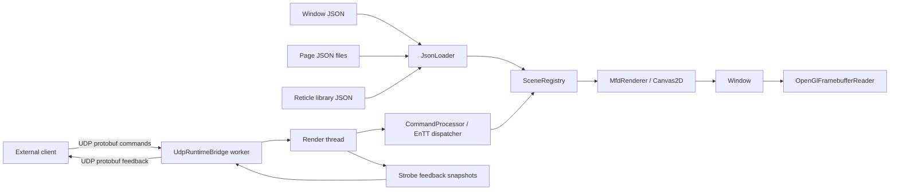

# MFDStudio

`MFDStudio` is a C++/CMake toolkit for authoring and operating 2D
multi-function display windows from JSON.

In the codebase, the historical technical prefix remains `mfd`
(namespaces, targets, folders, and APIs).

It is built for projects that need:

- a data-driven display model
- a real-time runtime API
- reusable reticle templates
- local or remote control over UDP
- optional feedback and framebuffer capture

The project combines `raylib`, `ImGui`, `rlImGui`, `EnTT`,
`nlohmann_json`, and Protocol Buffers over UDP into one workflow:

1. describe a window, its pages, and reusable reticles in JSON
2. launch a runtime window that renders the active page
3. drive the scene locally or from an external client
4. receive strobe feedback or framebuffer readback when required

## Highlights

- JSON-authored windows, pages, and reusable reticle templates
- runtime control of visibility, position, rotation, color, thickness, text,
  and letter spacing
- dynamic reticles that can be added, updated, and removed at runtime
- page-managed blink groups and optional strobe feedback
- RGBA32 framebuffer capture
- typed client UI generation through `client_api_generate_ui(...)`
- example launchers, mockup clients, editor tooling, and automated tests

## Start Here

If you are new to the project, use this reading order:

1. [Quick Start](./docs/QUICKSTART.md)
2. [Core Concepts](./docs/CONCEPTS.md)
3. [JSON Reference](./docs/reference/README.md)
4. [Tutorial Index](./docs/tutorials/README.md)

If you already know your goal, these are the fastest paths:

- Author JSON and validate it visually:
  [Create Reticles From Primitives](./docs/tutorials/01_create_reticles_from_primitives.md),
  [Create Pages And Windows](./docs/tutorials/02_create_pages_and_windows.md),
  [Test A Window With The Mockup](./docs/tutorials/03_test_with_mfd_mockup.md)
- Integrate an external client:
  [Drive A Window From A Live Client Over UDP](./docs/tutorials/04_drive_a_window_from_a_live_client.md),
  [Add And Remove Dynamic Reticles](./docs/tutorials/05_dynamic_reticles.md),
  [Project User Space To Page Space](./docs/tutorials/08_project_user_space_to_page_space.md)
- Drive the cockpit showcase:
  [Drive The Cockpit Demo](./docs/tutorials/10_cockpit_demo.md)
- Understand the generated client-side API:
  [Use The Mockup As A Client API Reference](./docs/tutorials/11_use_the_mockup_as_a_client_api_reference.md)
- Work on reliability and validation:
  [Run The Automated Runtime Tests](./docs/tutorials/12_run_the_automated_runtime_tests.md)

## Quick Build

### Requirements

- Visual Studio 2022
- CMake 3.26 or newer
- Python 3

The repository currently ships Visual Studio 2022 presets for `x64` and
`Win32`.

The first configure fetches third-party dependencies automatically, so expect
the initial build to take longer than incremental builds.

### Configure and build

```powershell
cmake --preset vs2022-x64
cmake --build --preset debug-x64
cmake --build --preset release-x64

cmake --preset vs2022-win32
cmake --build --preset debug-win32
cmake --build --preset release-win32
```

### Common build options

- `MFD_BUILD_DEMO=ON`
  Builds the example applications and editor.
- `MFD_BUILD_TESTS=ON`
  Builds the GoogleTest-based validation suite.
- `MFD_ENABLE_WARNINGS=ON`
  Enables stricter compiler warnings.

## Run A First End-to-End Demo

For a quick first run, build the standard demo window and GUI mockup:

```powershell
cmake --preset vs2022-x64
cmake --build --preset debug-x64 --target mfd_demo client_mockup
```

Then:

1. launch `mfd_demo`
2. launch `client_mockup`
3. activate a page from the mockup
4. move or recolor a reticle and watch the window update immediately

For a cockpit-oriented end-to-end flow, use:

```powershell
cmake --build --preset debug-x64 --target mfd_demo_cockpit client_mockup_minimal
```

The full walkthrough is documented in
[Quick Start](./docs/QUICKSTART.md) and
[Drive The Cockpit Demo](./docs/tutorials/10_cockpit_demo.md).

## Shipped Applications

| Application | Purpose |
| --- | --- |
| `mfd_window` | Generic runtime launcher that accepts a window JSON file. |
| `examples/mfd_demo` | Ready-to-run demo window based on `assets/windows/demo_pages.json`. |
| `examples/mfd_demo_minimal` | Minimal demo window based on `assets/windows/demo_pages_minimal.json`. |
| `examples/mfd_demo_cockpit` | Cockpit showcase window based on `assets/windows/demo_pages_cockpit.json`. |
| `examples/client_mockup` | GUI client for page control, reticle updates, dynamic reticles, and feedback inspection. |
| `examples/client_mockup_minimal` | Headless cockpit client showing the public API from one plain `main` loop. |
| `mfd_editor` | Visual authoring tool for windows, pages, and reticles. |

A data-only inspired sample pack is also shipped under:

- `assets/windows/demo_pages_inspired.json`
- `assets/pages/hsd_inspired.json`
- `assets/pages/fcr_inspired.json`
- `assets/pages/had_inspired.json`
- `assets/pages/tgp_inspired.json`
- `assets/pages/sms_inspired.json`
- `assets/pages/flcs_inspired.json`

Open it with `mfd_window assets/windows/demo_pages_inspired.json` or through
`mfd_editor` using **Open window asset...**.

## Generated Client UI

If you want typed page and reticle accessors on the client side,
`client_api_generator` can generate them directly from a window JSON file.
The same generation step can also emit a companion
`assets/windows/<window>.generated.map` file that the runtime loads
automatically when it is present next to the root window JSON.

Use the CMake helper:

```cmake
client_api_generate_ui(
    WINDOW_JSON "assets/windows/demo_pages_cockpit.json"
    OUTPUT_HEADER "${CMAKE_CURRENT_SOURCE_DIR}/generated/MockupUi.h"
    OUTPUT_SOURCE "${CMAKE_CURRENT_SOURCE_DIR}/generated/MockupUi.cpp"
    OUTPUT_MAP "${MFD_ROOT_DIR}/assets/windows/demo_pages_cockpit.generated.map"
    NAMESPACE "mockup_ui"
    UI_CLASS_NAME "CockpitMockupUi"
    HEADER_INCLUDE "MockupUi.h")
```

This is the same pattern used by the shipped mockup executables.

Example client-side usage:

```cpp
#include "MockupUi.h"
#include "mfd/control/CommandClient.h"

mfd::WindowUdpCommandTransport transport;
transport.enabled = true;
transport.address = "127.0.0.1";
transport.port = 47220;
transport.maxPacketSize = 16384;

mfd::CommandClient client(transport);
client.ActivatePage(mockup_ui::CockpitMockupPage::Name());

mockup_ui::CockpitMockupUi ui;
auto& contacts = ui.Cockpit().Dynamic("cockpit_radar_contact");
contacts.SetVisible(true);
```

For the full generated-client workflow, including batch submission and dynamic
reticles, see:

- [Use The Mockup As A Client API Reference](./docs/tutorials/11_use_the_mockup_as_a_client_api_reference.md#generated-client-ui-in-2-minutes)

## What You Can Build

With `MFDStudio`, you can:

- load a window and its pages from JSON
- define reusable reticle templates from drawable primitives
- assign one library reticle as a page-local strobe directly from the editor
- choose source asset folders from guided editor popups instead of accidentally writing new JSON files under `_Exec`
- activate pages and update page view state at runtime
- patch static reticles or manage dynamic reticles in bulk
- synchronize reticles through page-managed blink groups
- drive a window from an external client over compact UDP protobuf messages
- receive strobe state and capture feedback back from the runtime
- capture the final framebuffer as typed `RGBA32`
- keep client-side physical coordinates and project them to page space only
  when sending commands

## Architecture



In practice:

- JSON files define what exists
- `SceneRegistry` owns the runtime state
- a background worker receives UDP commands and sends feedback
- the render thread drains queued commands and updates the scene
- the renderer draws only the active page
- framebuffer capture stays available as a downstream integration point

### Threading model

The default window runtime uses two threads:

- one render thread
  owns `SceneRegistry`, `CommandProcessor`, `EnTT`, and rendering
- one UDP I/O worker thread
  owns sockets, receives command packets, and emits feedback packets

Important rule:

- the UDP worker never mutates the scene directly
- it only pushes decoded commands into a thread-safe queue
- the render thread drains that queue and applies updates
- per-frame command application is intentionally bounded to avoid frame stalls

This keeps `raylib`, `OpenGL`, and runtime state on one thread while still
decoupling network I/O from rendering.

## Authoring Model

### Window JSON

A root window file defines:

- title
- pixel size
- initial screen position
- target FPS
- optional text font
- reticle library folder
- command transport
- optional feedback transport
- list of page files
- optional `defaultPage`

Example:

```json
{
  "title": "MFDStudio EnTT Demo",
  "size": [1600, 960],
  "position": [80, 60],
  "targetFps": 60,
  "fontFile": "../fonts/ocr_a.ttf",
  "reticleLibraryFolder": "../reticles",
  "commands": {
    "udp": {
      "enabled": true,
      "address": "127.0.0.1",
      "port": 47220,
      "maxPacketSize": 16384
    }
  },
  "feedback": {
    "udp": {
      "enabled": true,
      "address": "127.0.0.1",
      "port": 47221,
      "maxPacketSize": 4096
    }
  },
  "defaultPage": "Radar",
  "pages": [
    "../pages/pfd.json",
    "../pages/navigation.json",
    "../pages/radar.json"
  ]
}
```

### Page JSON

A page defines one named view inside the window.

Typical page data includes:

- a page name and optional title
- a background color
- a page view center and zoom
- optional blink types
- static reticle instances
- optional strobe behavior

Example:

```json
{
  "name": "Radar",
  "title": "Radar",
  "backgroundColor": "#061306FF",
  "blinkTypes": [
    { "name": "slow", "durationMs": 1000 },
    { "name": "fast", "durationMs": 320 }
  ],
  "view": {
    "center": [0.0, 0.0],
    "zoom": 1.0
  },
  "staticReticles": [
    {
      "id": "fixed_track_alpha",
      "template": "radar_track",
      "blink": "slow"
    }
  ]
}
```

### Reticle JSON

Reticle templates live in `assets/reticles` and are reused by pages.

A reticle is made of one or more primitives. Supported primitive types are:

- `text`
- `time`
- `line`
- `circle`
- `rectangle`
- `ellipse`
- `square`
- `diamond`
- `triangle`
- `polyline`
- `bezier`

For the exact field reference, aliases, and JSON rules, see:

- [Common JSON Syntax](./docs/reference/common_json_syntax.md)
- [Primitive Reference](./docs/reference/primitive_reference.md)
- [Page And Window Reference](./docs/reference/page_and_window_reference.md)

### Coordinate system

Authoring and runtime both use normalized logical coordinates, not pixels.

```text
          y = +1
            ^
            |
 x = -1 <---+---> x = +1
            |
            v
          y = -1
```

Rules:

- logical space is `[-1, 1]`
- `(0, 0)` is the center of the page
- positive `x` goes right
- positive `y` goes up
- authored layouts stay stable when the window is resized

### Blink model

Blink is page-managed.

- each page may declare several named blink types
- each blink type resolves to one duration in milliseconds
- reticles opt in to blinking at the page level
- reticles using different names but the same duration blink in phase

## Public API At A Glance

| Use case | Main entry point |
| --- | --- |
| Load authored content | `mfd/io/JsonLoader.h` |
| Drive the scene locally | `mfd/runtime/SceneRegistry.h` |
| Drive a window remotely | `mfd/control/CommandClient.h` |
| Host a window with UDP I/O | `mfd/control/UdpRuntimeBridge.h` |
| Send dynamic reticles in bulk | `mfd::DynamicReticleState` with `CommandClient` |
| Project user space to page space | `mfd/control/UserSpaceProjector.h` |
| Receive strobe feedback | `mfd::CreateFeedbackReceiverChannel(...)` and `mfd::DeserializeStrobeStatusFeedback(...)` |
| Capture the framebuffer | `mfd/render/OpenGlFramebufferReader.h` |
| Attach a capture callback to the launcher | `mfd/window/WindowLauncher.h` |

Representative examples:

### Load a window

```cpp
#include "mfd/io/JsonLoader.h"

mfd::JsonLoader loader;
const mfd::LoadedWindowConfiguration loaded =
    loader.LoadWindowConfiguration("assets/windows/demo_pages.json");
```

### Drive a scene locally

```cpp
#include "mfd/runtime/SceneRegistry.h"

mfd::SceneRegistry scene(loaded.document);
scene.SetActivePage("Radar");
scene.SetPageView("Radar", {{0.15f, -0.05f}, 1.8f});
scene.SetReticlePosition("Radar", "fixed_track_alpha", {0.25f, 0.10f});
scene.SetReticleText("Radar", "fixed_track_alpha", "T01");
```

### Drive a window remotely

```cpp
#include "mfd/control/CommandClient.h"

mfd::WindowUdpCommandTransport udp;
udp.enabled = true;
udp.address = "127.0.0.1";
udp.port = 47220;
udp.maxPacketSize = 16384;

mfd::CommandClient client(udp);
client.ActivatePage("Radar");
client.SetReticlePosition("Radar", "fixed_track_alpha", {0.20f, 0.35f});
client.SetReticleColor("Radar", "fixed_track_alpha", {77, 224, 255, 255});
client.SetReticleVisible("Radar", "fixed_track_alpha", true);
```

### Send dynamic reticles in bulk

```cpp
std::vector<mfd::DynamicReticleState> tracks;

tracks.push_back({
    "track_001",
    mfd::ReticlePatch {
        .visible = true,
        .position = mfd::Vec2 {0.20f, 0.35f},
        .rotationDegrees = 15.0f,
        .text = std::string {"AF001"}
    }});

client.UpsertDynamicReticles("Radar", "radar_track", tracks);
```

`CommandClient` automatically splits oversized batches according to the
configured UDP packet size.

For a full runtime reset, a client can also request:

```cpp
client.ResetWindow();
```

### Project client-side user space to page space

```cpp
#include "mfd/control/UserSpaceProjector.h"

mfd::UserSpaceFrame frame;
frame.pageAnchor = {0.0f, -0.3f};
frame.pageUnitsPerUserUnit = 0.04f;
frame.userXAxisInPage = {0.0f, 1.0f};
frame.userYAxisInPage = {1.0f, 0.0f};

mfd::UserSpaceProjector projector(frame);
const mfd::Vec2 pagePosition = projector.ToPagePosition(trackWorldPositionNm);
```

### Capture the framebuffer as `RGBA32`

```cpp
#include "mfd/render/OpenGlFramebufferReader.h"

mfd::Rgba32Framebuffer capture = mfd::OpenGlFramebufferReader::ReadRgba32();
```

The returned buffer exposes:

- `width`
- `height`
- typed `Rgba8Pixel` pixels
- `Pixels()`
- `Bytes()`

If you host a window through `mfd::window::RunLauncher`, you can also attach a
callback that receives the final byte span every frame. The launcher uses an
asynchronous PBO readback path when the active desktop OpenGL backend exposes
the required buffer and sync entry points, and falls back to synchronous
`OpenGlFramebufferReader` capture otherwise. See:

- [Capture The Window As RGBA32](./docs/tutorials/07_framebuffer_rgba32_capture.md)

### Strobe control and feedback

A page may expose an optional strobe that can be enabled, moved, and queried
through feedback channels.

See:

- [Control The Strobe And Receive Feedback](./docs/tutorials/06_strobe_control_and_feedback.md)

## Tests

The default build includes GoogleTest-based validation through
`mfd_api_tests`.

Default behavior:

- `MFD_BUILD_TESTS=ON`
- the regular build compiles the test suite
- the suite focuses on JSON loading and runtime rules

Commands:

```powershell
cmake --preset vs2022-win32
cmake --build --preset debug-win32

.\build\vs2022-win32\mfd_api\tests\Debug\mfd_api_tests.exe
```

There is also a convenience target:

```powershell
cmake --build --preset debug-win32 --target mfd_api_tests_run
```

## Release Workflow

The repository includes a release pipeline in
`.github/workflows/release.yml`.

Recommended first release flow:

1. ensure `main` is green on CI
2. create and push a semantic tag such as `1.0.0` or `v1.0.0`
3. let GitHub Actions build Win32 and x64 archives and publish the release

Example:

```bash
git tag 1.0.0
git push origin 1.0.0
```

Published assets include:

- `mfd-<tag>-x64.zip`
- `mfd-<tag>-win32.zip`
- `SHA256SUMS.txt`

Manual release is also available from the GitHub Actions UI.

## Project Layout

| Path | Role |
| --- | --- |
| `mfd_api` | Public API library and runtime core. |
| `client_api` | Client-side helper library used by manual and generated clients. |
| `client_api_generator` | CMake + Python generator for typed client UI wrappers. |
| `mfd_window` | Generic window host application. |
| `mfd_editor` | Visual authoring tool that starts empty and lets you open a chosen window asset or create assets on demand. |
| `examples` | Demo launchers and sample clients. |
| `assets/windows` | Root window JSON files. |
| `assets/pages` | Page JSON files. |
| `assets/reticles` | Reusable reticle templates. |
| `docs` | Quick start, concepts, tutorials, and JSON reference. |

Tutorial-generated example targets such as `client_tutorial` are only configured once the full tutorial asset set has been authored and saved under the repository `assets/` tree.

## Documentation

Documentation is organized into four layers:

- [Quick Start](./docs/QUICKSTART.md)
- [Core Concepts](./docs/CONCEPTS.md)
- [Tutorial Index](./docs/tutorials/README.md)
- [JSON Reference](./docs/reference/README.md)

The public headers in `mfd_api/include/mfd` are also documented with Doxygen
using `@brief`, `@param`, `@return`, and `@note`, so the API remains readable
from the IDE as well as from the Markdown guides.

## Third-Party Licenses

An inventory of external dependencies and copied license texts is available in:

- [THIRD_PARTY_NOTICES.md](./THIRD_PARTY_NOTICES.md)
