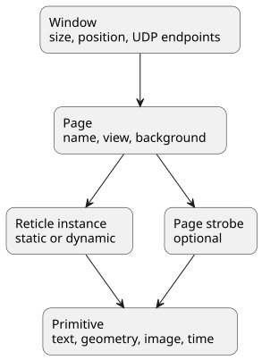

# Core Concepts

This page explains the minimum vocabulary you need before diving into the
tutorials or the JSON reference.

## The Authored Model



## Window

A window is the top-level runtime unit.

It defines:

- title
- pixel size and screen position
- reticle library folder
- incoming command transport
- optional outgoing feedback transport
- the list of page JSON files to load

Think of the window as the container that hosts the runtime session.

## Page

A page is one named view inside the window.

A page defines:

- its `name`
- an optional title
- an optional title chrome display state controlling how that title is shown
- a background color
- a page view center and zoom
- optional page-local blink types
- static reticles
- an optional strobe

Only one page is active and rendered at a time.

The title text itself remains page-owned, but its rendered chrome can now be
authored independently: visible or hidden, underlined or framed, recolored, and
moved or scaled inside the page space.

## Reticle

A reticle is a reusable visual symbol or widget.

Typical examples:

- aircraft symbol
- compass rose
- radar track
- clock widget
- strobe cursor

A reticle can be:

- static: authored in the page JSON and present when the page loads
- dynamic: created and removed at runtime by the client API

Important distinction:

- the reticle template is the reusable definition
- the page reticle is one instance of that template on one page

## Primitive

A primitive is the smallest drawable element.

Supported primitive families include:

- text and time
- line and polyline
- circle, ring, square, rectangle, ellipse, diamond, triangle
- bezier and arc
- image-backed primitives where relevant

A reticle is built from one or more primitives.

## Strobe

A strobe is an optional page-level cursor-like reticle.

It can:

- be enabled or disabled
- move on the page
- capture nearby targets
- magnetize to the nearest target
- send live feedback to the client

Use it when one page needs cursor, designation, or probing behavior.

## Blink

Blink is managed by the page, not by the reticle library.

Each page can define:

- several named blink types
- one optional default blink type

Each blink type is described by:

- a name
- an effective duration in milliseconds

What matters at runtime is the duration:

- two blink types with the same duration blink in phase
- changing a reticle from one blink type to another reattaches it to the new phase group

## Coordinates

Everything authored in JSON and everything driven from the client API uses the
same normalized coordinate space.

```text
          y = +1
            ^
            |
 x = -1 <---+---> x = +1
            |
            v
          y = -1
```

Examples:

- `(0.0, 0.0)` is the page center
- `(0.5, 0.0)` is halfway to the right edge
- `(-0.25, 0.75)` is in the upper-left area

This is why the same page content remains valid when the window size changes.

## Runtime Identity

The identifiers that matter most at runtime are:

- page name
- reticle id
- optional primitive id

Examples:

- page: `Radar`
- static reticle: `fixed-track`
- dynamic reticle: `track_042`
- primitive inside a reticle: `track_label`

## Runtime Flow


The normal loop is:

1. author assets
2. load them in `mfd_window`
3. send commands from a client
4. render the updated active page
5. optionally receive runtime feedback

## What To Read Next

| If you need... | Read |
| --- | --- |
| a first live session | [Quick Start](./QUICKSTART.md) |
| step-by-step workflows | [Tutorial Index](./tutorials/README.md) |
| exact JSON syntax | [JSON Reference](./reference/README.md) |
| contributor-oriented build details | [Development Guide](./DEVELOPMENT.md) |
