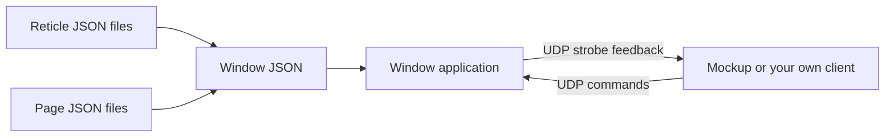
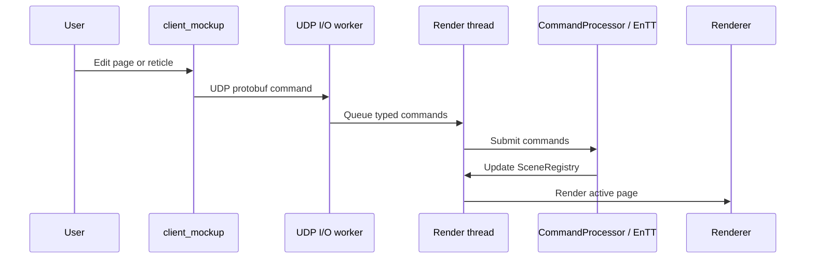

# Quick Start

This page is the fastest way to understand the project and get a visible result.

## Goal

In about 10 minutes you will:

- launch a window
- launch the mockup
- activate a page
- move a reticle
- see how the client and the window talk to each other over UDP

## Mental Model



Keep this simple model in mind:

- JSON files describe what exists
- the window application renders it
- a client sends runtime commands

## Step 1 - Build the project

```powershell
cmake --preset vs2022-win32
cmake --build --preset debug-win32
```

This default build also compiles the `GoogleTest` suite used to validate the
runtime API and JSON loading rules.

## Step 2 - Start a ready-to-use window

Launch one of the example windows:

- `examples/mfd_demo`
- `examples/mfd_demo_minimal`

For a first run, `examples/mfd_demo` is the easiest option.

## Step 3 - Start the mockup

Launch `client_mockup`.

The mockup is your control panel. It lets you test:

- page activation
- page zoom
- reticle updates
- dynamic reticles
- strobe control
- strobe feedback

## Step 4 - Activate the Radar page

In the mockup:

1. select the demo target
2. open the page tree
3. select `Radar`
4. click `Activate page now`

## Step 5 - Move one reticle

Still in the mockup:

1. expand the `Radar` page
2. select one reticle
3. change `Position`
4. click `Send reticle update`

You should immediately see the reticle move in the window.

## Step 6 - Test live dynamic tracks

In the radar tools section of the mockup:

1. enable the simulated radar batch
2. watch the radar page update with many tracks
3. watch the reported send time and UI FPS

## Step 7 - Understand what just happened

You have already exercised the full runtime loop:



## What You Should Read Next

Choose the path that matches your goal:

- create reusable reticles: [01 Create Reticles From Primitives](./tutorials/01_create_reticles_from_primitives.md)
- create your own page and window JSON: [02 Create Pages And Windows](./tutorials/02_create_pages_and_windows.md)
- understand the mockup as a real UDP client: [11 Use The Mockup As A Client API Reference](./tutorials/11_use_the_mockup_as_a_client_api_reference.md)
- integrate a live external client: [04 Drive A Window From A Live Client Over UDP](./tutorials/04_drive_a_window_from_a_live_client.md)
- use dynamic radar-style tracks: [05 Dynamic Reticles](./tutorials/05_dynamic_reticles.md)
- try the integrated showcase: [10 Drive The Cockpit Demo](./tutorials/10_cockpit_demo.md)
- run the automated runtime tests: [12 Run The Automated Runtime Tests](./tutorials/12_run_the_automated_runtime_tests.md)

## Common First-Time Mistakes

- editing coordinates as if they were pixels instead of `[-1, 1]`
- forgetting that page names and reticle ids are case-sensitive runtime identifiers
- sending commands to the wrong UDP port
- trying to control a reticle id that does not exist on the selected page
