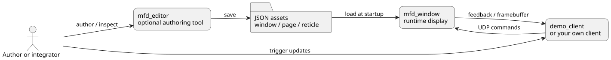

# Concepts

The minimum vocabulary you need before the tutorials or the JSON reference.


## Window

The top-level runtime unit. It defines the title, pixel size and screen
position, the reticle library folder, the incoming command transport, an
optional outgoing feedback transport, and the list of page JSON files to load.

## Page

One named view inside the window. A page owns its `name`, an optional title and
title-chrome display state, a background color, a view center and zoom, optional
page-local blink types, static reticles, and an optional strobe catalog with one
authored active selection. Only one page is active and rendered at a time.

## Reticle

A reusable visual symbol or widget (aircraft symbol, compass rose, radar track,
clock, strobe cursor). A reticle is built from one or more primitives.

- **static**: authored in the page JSON, present when the page loads
- **dynamic**: created and removed at runtime by the client API

The **template** is the reusable definition in the library; a **page reticle**
is one instance of that template placed on one page.

## Primitive

The smallest drawable element: text and time, line and polyline, circle, ring,
square, rectangle, ellipse, diamond, triangle, bezier, arc, and image-backed
primitives where relevant.

## Strobe

An optional page-level cursor-like reticle capability. A page can expose one
legacy single strobe or several named variants in `strobes`, plus one
`activeStrobe` selection. The active strobe can be enabled or disabled, move,
capture and magnetize to targets, be switched dynamically by the client, and
send feedback.

## Blink

Managed by the page, not the reticle library. Each page can define several named
blink types and one optional default. What matters at runtime is the duration:
two blink types with the same duration blink in phase.

## Coordinates

Everything authored in JSON and driven from the client API uses the same
normalized coordinate space.

```text
          y = +1
            ^
            |
 x = -1 <---+---> x = +1
            |
            v
          y = -1
```

`(0, 0)` is the page center, `(0.5, 0.0)` is halfway to the right edge. This is
why the same page content stays valid when the window size changes.

## Runtime flow



1. author assets
2. load them in `mfd_window`
3. send commands from a client
4. render the updated active page
5. optionally receive runtime feedback

The identifiers that matter at runtime are the page name, the reticle id, and an
optional primitive id.
