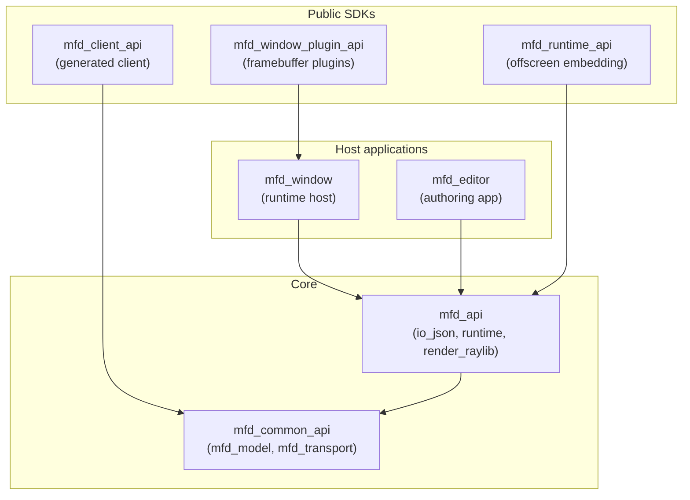
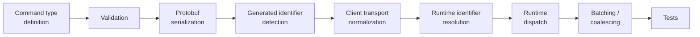

# Architecture

The repository is split into coherent modules with narrow public surfaces.

## Module layers

| Module | Role |
| --- | --- |
| `mfd_common_api` | Internal shared low-level module owning the reusable `mfd_model` and `mfd_transport` static libraries (with its own `include/`, `src/`, `proto/`). |
| `mfd_api` | Core tree producing `mfd_io_json`, `mfd_runtime`, the public `mfd_api` DLL, the host-side static `mfd_render_raylib` layer, and the `mfd::api` umbrella. |
| `mfd_runtime_api` | Offscreen embedding package: renders an MFD without `mfd_window`. |
| `mfd_client_api` | Client-side helper layer producing `mfd_client_api`; includes the Python/CMake generator under `generator/`. |
| `mfd_window_plugin_api` | Public framebuffer-plugin SDK. |
| `mfd_window` | Generic runtime host executable with the `F1` debug overlay. |
| `mfd_editor` | Visual authoring application. |

The real build graph is `mfd::model` → `mfd::transport` → `mfd::io_json` →
`mfd::runtime` → `mfd::render_raylib`. The historical `mfd::api` name remains
only as a convenience umbrella.

`mfd::render_raylib` is intentionally host-side only: it stays outside the
`mfd_api` DLL boundary so host applications (`mfd_editor`, `mfd_window`) keep one
single static `raylib`/`rlgl` instance inside the process. The published
client-facing API therefore stays render-agnostic.

## Client SDK boundary

The packaged client SDK is deliberately curated. External consumers use
`find_package(MFDStudioClientApi)` and `MFDStudio::ClientApi`, link only
`mfd_client_api.dll`, and receive only the headers and import libraries generated
clients need — not `mfd_api.lib`, `SceneRegistry.h`, `CommandProcessor.h`, or the
host-side render layer. The reference consumer is `examples/client_test_package`.

## CMake conventions

- internal repository targets and system libraries use plain `target_link_libraries(...)`
- third-party dependencies go through `cmake/ExternalLibraries.cmake`
- the root `CMakeLists.txt` only registers first-level directories
- `tests/` mirrors the tested modules; non-test child trees (`examples/*`) own
  their local `CMakeLists.txt`

Use the real target name with the helpers; the top-level project name is `MFD`,
so `${PROJECT_NAME}` is not a per-directory alias.

## Command consistency

Command behavior must stay consistent across the definition, protobuf
serialization, validation, generated identifier detection, client transport
normalization, runtime id resolution, runtime dispatch, batching/coalescing, and
tests. Prefer internal command helpers or command traits over duplicating a rule
across files.

Each of these stages dispatches over `UserCommand` through a visitor with one
explicit overload per command type and no generic fallback. Adding a new
`UserCommand` alternative therefore fails to compile at every stage until its
per-stage rule is written explicitly, instead of silently falling into a default
branch. The per-command page and template identity rules shared by several
stages live in `mfd/control/internal/CommandTraits.h`.

### Runtime identifier resolution — next phase design

The runtime still resolves generated transport ids back to authored name
strings at the command boundary, and most `SceneRegistry` entry points
re-normalize those names on every call. The intended next step keeps names at
the boundaries only, flowing small resolved references through the hot paths
instead:

- `ResolvedPageRef` — normalized page key plus page entity;
- `ResolvedStaticReticleRef`, `ResolvedTemplateRef`, `ResolvedPrimitiveRef` —
  resolved once after runtime identifier resolution and reused by dispatch,
  coalescing and the scene entry points.

`CommandProcessor` already normalizes the page key once per dynamic-set command
and reuses it through the private `*ByKey` scene entry points; extending the
same pattern to strobe updates and reticle patches, then replacing the
normalized string keys with `TransportId`-to-entity maps, removes string
normalization and hashing from the hot path without changing the public API.

Once commands flow as resolved references, a per-command inverse journal (each
handler records the pre-mutation state of only the entities it touches) can
replace the page-scoped rollback snapshot. That journal is a design target for
a later phase, not part of the current implementation.

## Repository layout

| Path | Role |
| --- | --- |
| `examples/demo/assets/windows`, `examples/demo/assets/pages`, `examples/demo/assets/reticles` | Authored JSON. |
| `branding` | Shared icons copied with the runtime hosts. |
| `Scripts` | Launch scripts staged next to runtimes. |
| `_Exec` | Local runtime staging (regenerated by `stage_exec`). |
| `_Deliveries` | SDK/install packages (only via `Scripts\BuildDeliveries.bat`). |
| `docs` | This book (`docs/src`) plus the Doxyfile and generation scripts. |
| `third_party` | Vendored or staged third-party material. |
