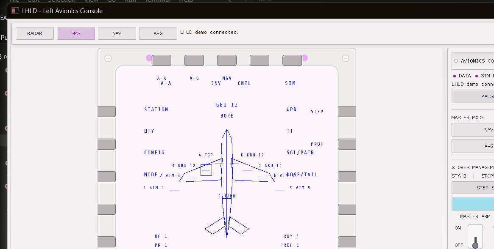
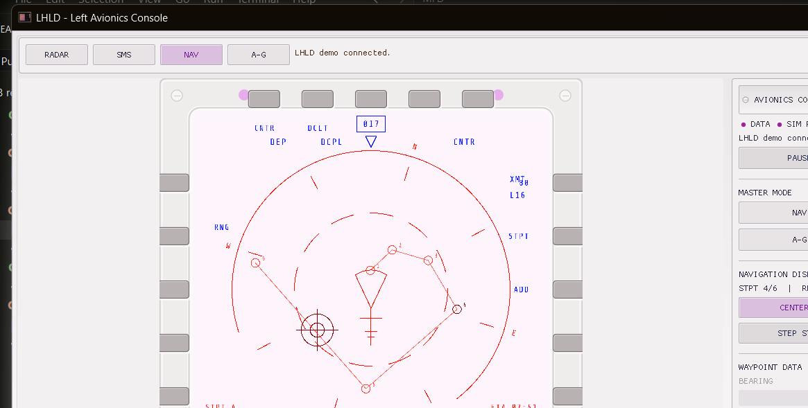
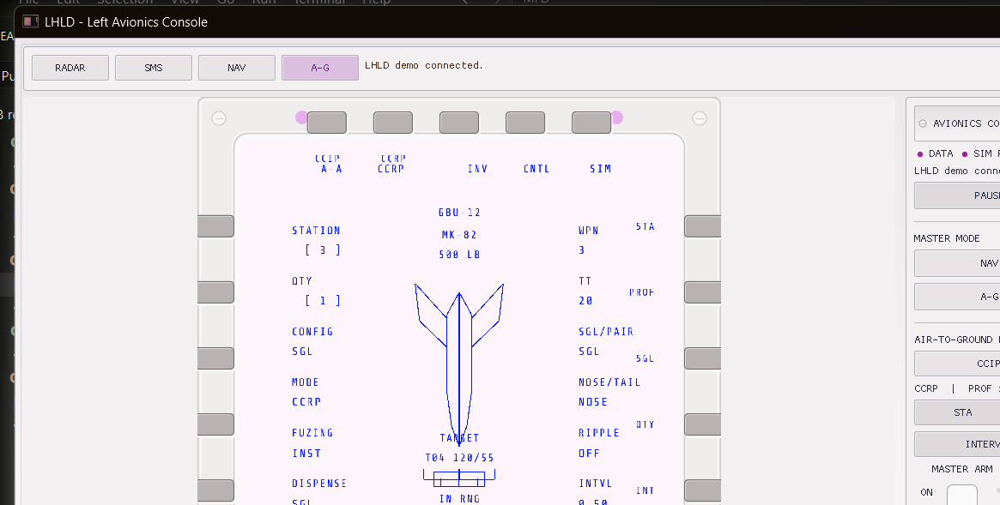
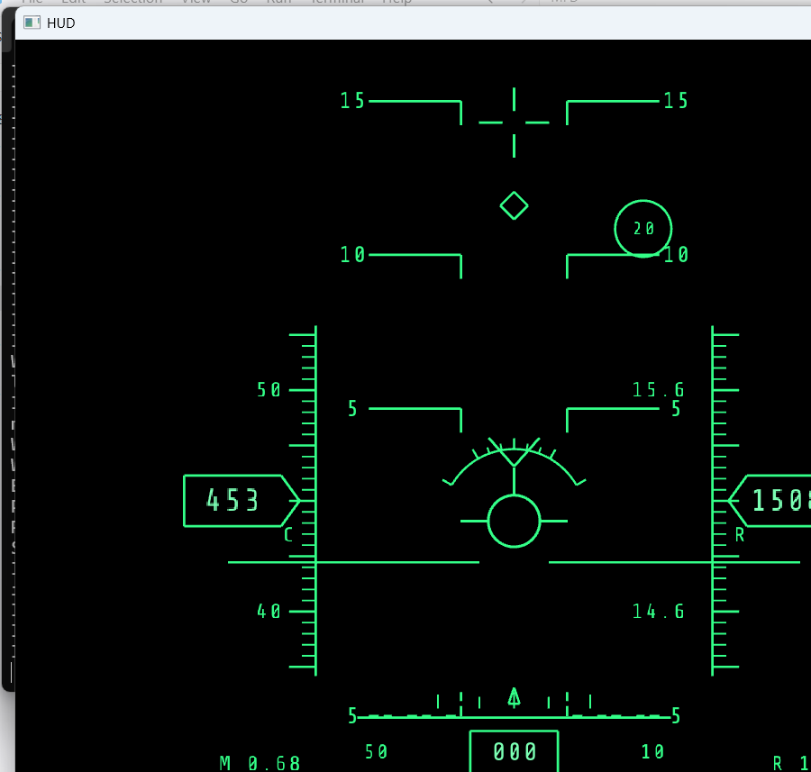
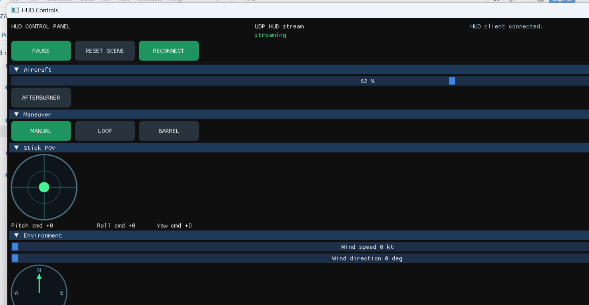
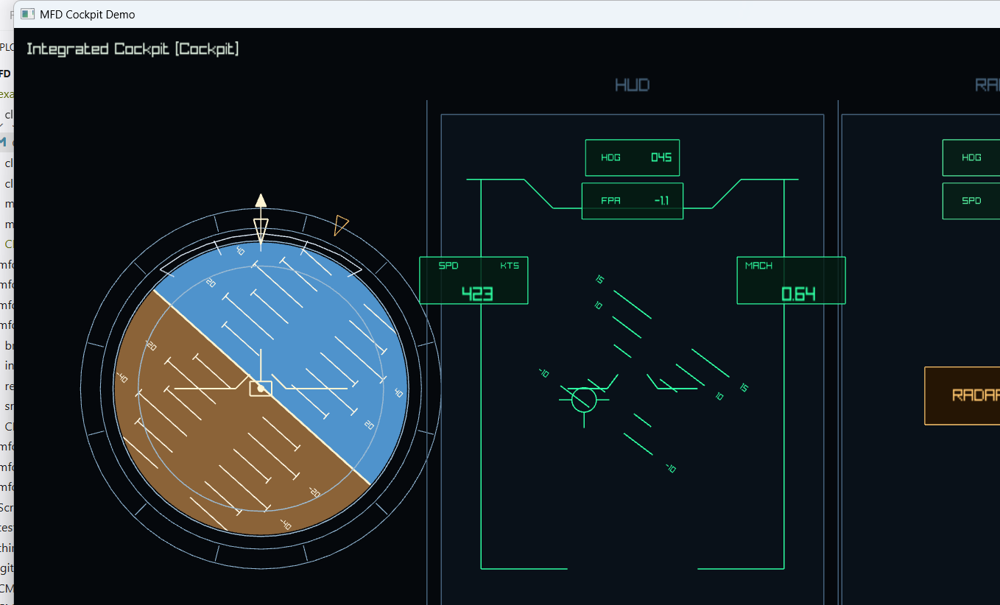

# Gallery

A visual tour captured from the shipped Win32 Debug applications. Every image
ships under `docs/src/images/` and links to the page that explains the workflow.

## LHLD avionics console

The LHLD client hosts the runtime in-process and presents four authored pages
inside a responsive 20-button bezel. The surrounding console exposes the
page-specific controls without mixing host layout with MFD projection.

| Stores management | Navigation | Air-to-ground |
| --- | --- | --- |
|  |  |  |

-> [LHLD guide](./handbook/lhld.md)

## Live HUD

The dedicated runtime window renders conformal flight and targeting cues from
semantic input published by `hud_runtime`.

The companion client keeps the replaceable sample simulation and operator
controls outside the reusable HUD runtime library.

-> [HUD guide](./handbook/hud.md)

## Runtime

`mfd_window` running a shipped asset driven live over UDP. Reproduce the simple
demo with `Scripts\Start-MfdDemo.bat` and `demo_client`, or the load scenario
with `Scripts\Start-RadarLoad.bat` and `radar_load_client`.

-> [Runtime](./handbook/runtime.md) | [Getting Started Tutorial](./getting-started.md)

## Visual editor

`mfd_editor` authoring one loaded page with the main workspace surfaces visible
at the same time. JSON stays the source of truth, but the editor is the fastest
way to inspect authored pages, reticles, layers, and page-local diagnostics.

The matching handbook page zooms in on the main zones:

- left sidebar: page tree, reticle library, filters, and quick actions
- center preview: selection, zoom, smart tools, fullscreen, and helper overlays
- helper panels: layer inspector, minimap, and validation problems
- right inspector: page, reticle, and primitive settings

-> [Editor](./handbook/editor.md)

## Demo Client

`demo_client`, the shipped GUI client. It loads a window JSON for discovery and
sends live commands to the runtime, which makes it a good reference client.

-> [Quick Start](./quickstart.md) | [Generated Client API](./handbook/generated_api.md)

## Object model

How a window owns pages, a page owns layers, a layer holds reticle instances, and
a reticle is built from primitives.

-> [Concepts](./concepts.md) | [Pages And Windows](./reference/pages_and_windows.md)

## Runtime round-trip

The authored-assets -> runtime -> client commands -> render -> feedback loop that
ties the whole system together.

-> [Concepts](./concepts.md) | [Public API Contract](./reference/public_contract.md)
