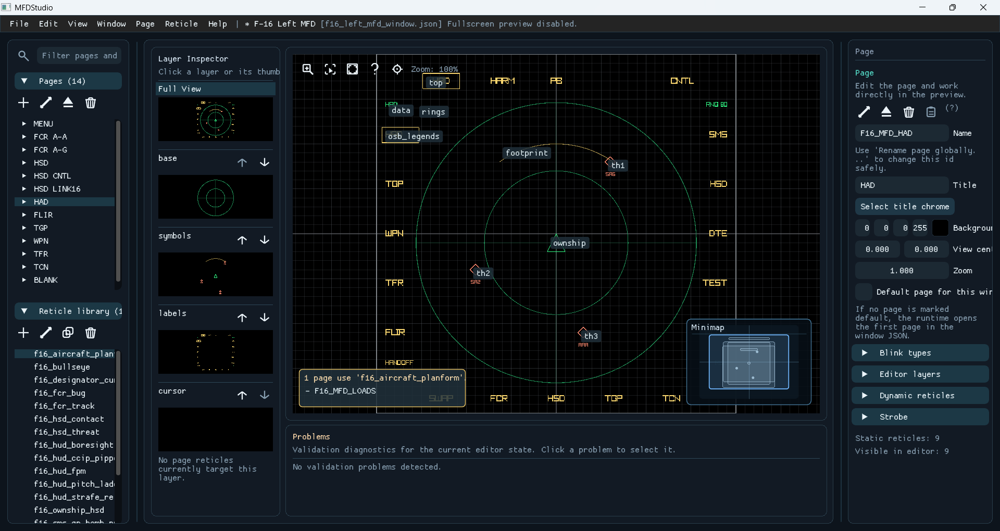
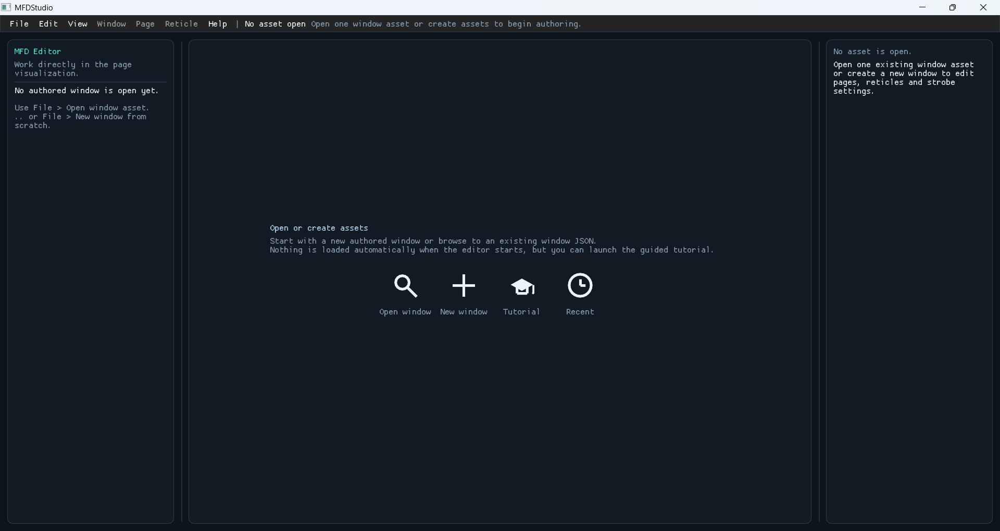
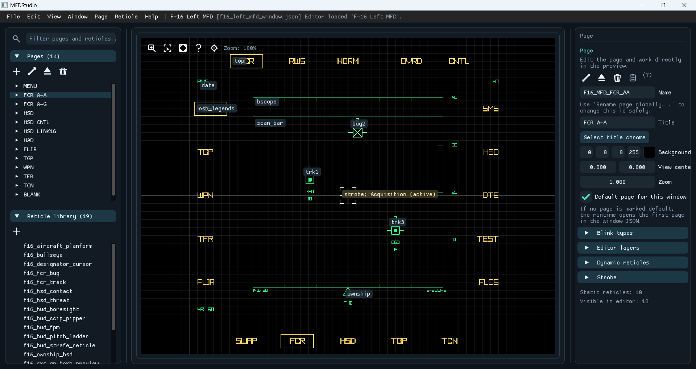
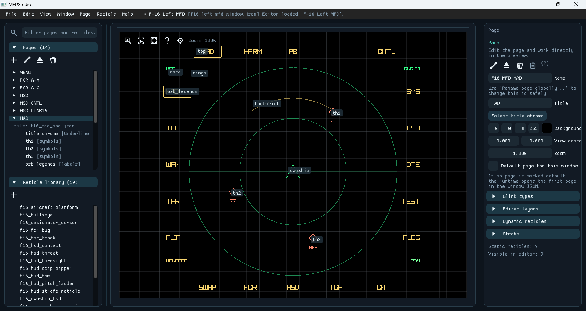
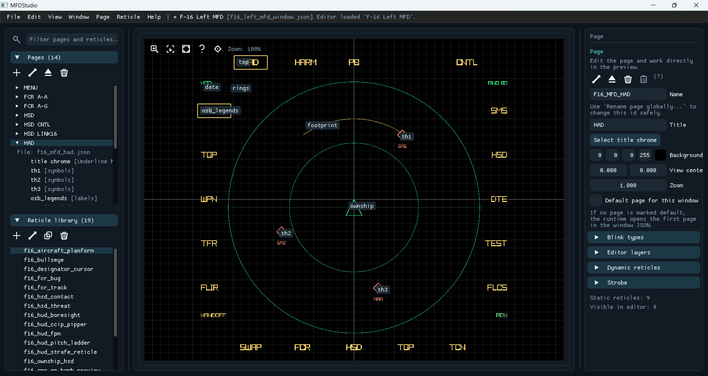
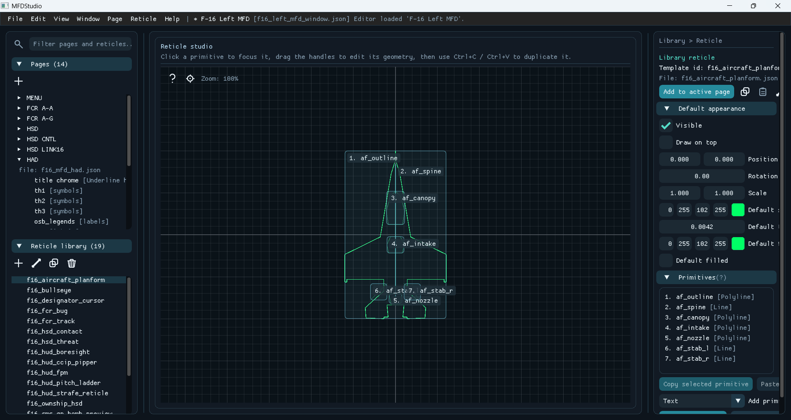
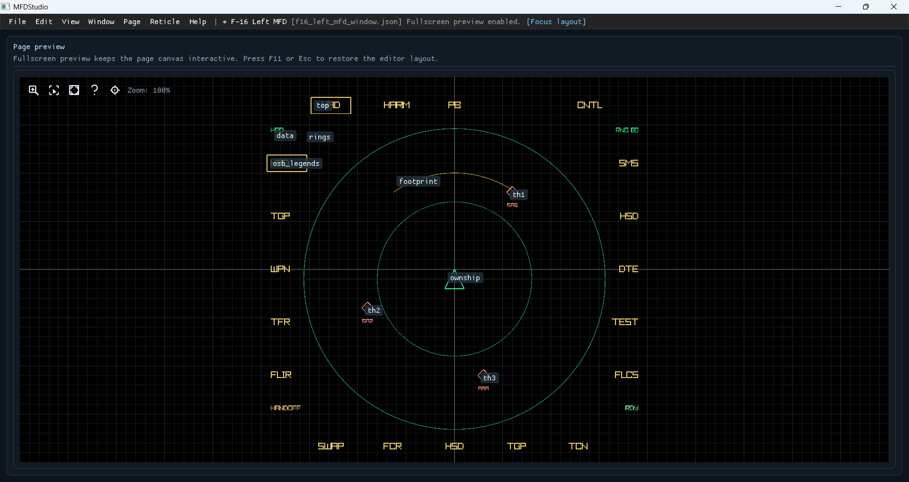

# Editor

`mfd_editor` is the visual authoring tool for windows, pages, and reticles. It
is optional: JSON files remain the source of truth, and you can author by hand,
in the editor, or mix both.



This overview uses one loaded workspace because it keeps the main authoring
surfaces visible at the same time:

- menu bar: global entry points for file, page, reticle, and help workflows
- navigation sidebar: page tree plus reticle library, with one shared filter
- layer inspector and helper panels: layer focus, minimap, and validation state
- page preview: the main authoring canvas for selection, zoom, and layout work
- right inspector: the editable properties of the current page, reticle, or primitive

## Start

```powershell
cmake --build --preset debug-win32 --target mfd_editor
```

The editor starts empty by design. Open a source window JSON or create a new
window from scratch: it never auto-loads staged `_Exec` copies, so you do not
accidentally edit runtime artifacts instead of the repository assets.



The start page keeps the first actions explicit:

- open one existing authored window asset
- create one new window from scratch
- launch the integrated tutorial
- reopen one recent source window quickly

## Open existing assets

Use **Open window** from the start page or **File > Open window asset...** from
the menu bar to browse one authored window JSON under one repository example
asset tree, such as `examples/demo/assets/windows`.

The editor opens source assets under `examples/*/assets` and never auto-loads
staged `_Exec` copies, so you stay on the authored files that belong under
version control.



Once one window is loaded, the normal authoring workspace takes over:

- the page tree mirrors the authored window hierarchy
- the page preview stays centered on the active page
- the right inspector follows the current selection
- the shared filter helps you jump between pages and reticles without leaving the workspace

## Authoring model

The editor writes text and time alignment (`left`, `center`, `right`) directly
into the asset model, matching what both the preview gizmos and `mfd_window`
render at runtime. It keeps one shared editor-only visible grid, snap toggle,
and logical grid step across the page preview and reticle studio **without**
serializing those preferences into the authored JSON.

## Responsive shell

The central workspace keeps priority. Narrowing the window first compresses,
then auto-collapses the sidebar and inspector instead of blocking the resize.
Auto-collapse is temporary and never changes saved panel widths; use the **View**
menu or widen the window to bring panels back.

In the fully loaded workspace, the left sidebar exposes pages and reticles, the
center keeps the preview tools visible, and the right inspector follows the
current selection. This is the recommended layout for authoring and for the
focused screenshots used below.

## Navigation sidebar



The top half of the sidebar is where page authoring stays anchored:

- the shared filter narrows the visible page and reticle lists from one query
- the page tree keeps the authored window, page file, and page-local instances visible
- the selected page stays highlighted in the tree and mirrored in the inspector
- the quick-action row keeps the most common page actions close to the tree

The **Pages** and **Reticle library** headers show live counts of entries passing
the current filter, and a line near the filter surfaces pending validation
problems (click it to open the Problems panel).

The filter box matches page and reticle names by default. Prefix the text to aim
one section:

- `page:` - pages only
- `reticle:` - reticles only
- `problem:` - only entries that still have validation issues

The branch holding the current selection stays expanded, and the first filtered
match opens automatically so results never hide behind a collapsed page.

The sidebar container itself never scrolls: the **Pages** and **Reticle library**
sections each own their scroll region so only the long list under the pointer moves.



The lower half keeps the library reticles separate from page instances:

- the library list stays reusable across every page of the current window
- selecting one template opens its shared definition without mutating page-local ids
- the lower quick-action row keeps library-specific actions near the template list

## Page preview toolbar

The page-preview header carries a compact glyph toolbar to the left of the help
(`?`) button:

- **Zoom box** - arm it, then drag a rectangle over the preview to zoom the page
  camera onto that region (same result as the mouse wheel, framed precisely).
- **Smart select** - arm it, then drag a rectangle to add every reticle inside it
  to the selection. With a layer focused in the layer inspector the pick is limited
  to that layer; in full view it spans every visible layer.
- **Fit to page** - scale and recenter the drawn reticles so their bounding box
  fills the page border. It is a single undoable step (`Ctrl+Z`).

Zoom box and smart select are one-shot: after a drag (or `Esc`) they disarm and the
left button returns to normal selection and dragging.

## Reticle studio



Opening one library reticle replaces the page preview with the reticle studio:

- the center canvas focuses one shared template at primitive level
- primitive labels and handles make geometry edits explicit
- the right inspector edits default appearance plus the primitive list
- the left library remains available so you can jump to another shared template quickly

## Validation problems

A line near the sidebar filter surfaces pending validation problems; clicking it
opens the docked **Problems** panel. Opening an asset that still has validation
problems reveals that panel automatically so an invalid asset never loads silently.

## Fullscreen preview



Fullscreen preview hides the surrounding editor chrome so the page canvas keeps
priority. Use it when you want to inspect placement, labels, or the active page
composition without the sidebar, inspector, minimap, or docked helper panels
competing for space.
