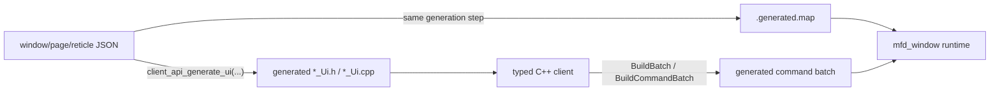
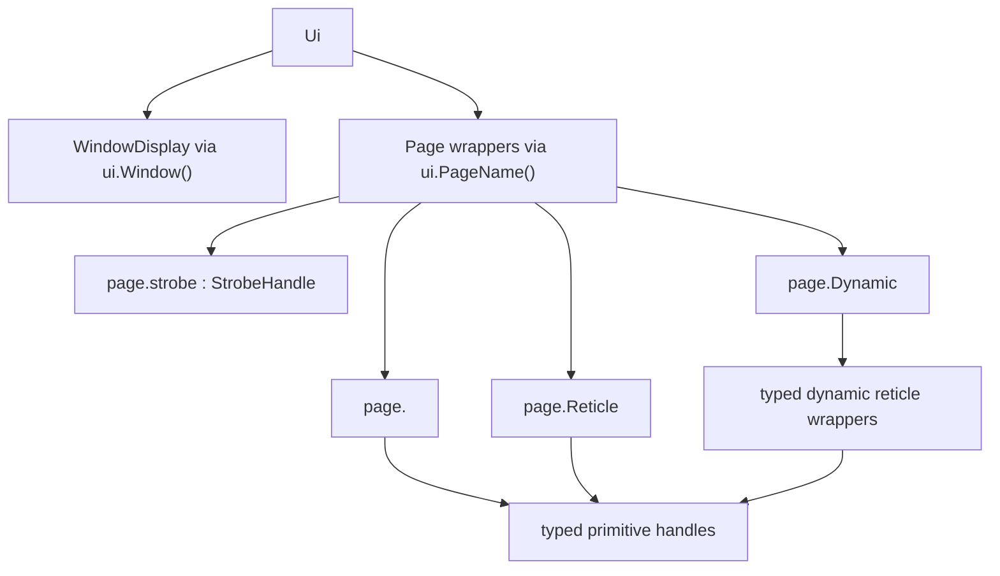

# Generated Client API

For a client dedicated to one authored window, the generated API is the
preferred surface. It gives typed access to the window display, pages, static
reticles, exposed primitives, strobes, and dynamic reticle sets, while
`CommandClient` remains the transport sender.

Use the generated API first whenever your application targets one known window.
Use raw name-based `CommandClient` helpers only for generic tooling, migration
code, or low-level debugging.

## What gets generated

`client_api_generate_ui(...)` emits three artifacts that must stay aligned:

- one generated header
- one generated source
- one companion `<window>.generated.map`



Treat those three outputs as one contract:

- the client uses the generated C++ types
- the runtime must load the matching `.generated.map`
- window-to-client feedback identifies pages, strobes, runtime reticles, and
  templates with numeric ids from that generated contract
- if the generated C++ and the map drift apart, generated batches are rejected

There is no name-based compatibility path for feedback identity. Regenerate and
ship the generated C++ and map together whenever authored identifiers change.
Only display/business payloads such as capture `label`, `category`, and
`metadata` remain textual.

See [Compatibility between runtime, map, and client](../reference/public_contract.md#compatibility-between-runtime-map-and-client)
for the runtime-side details.

## Generated header shape

The generated root keeps each responsibility explicit instead of mixing
window-level, page-level, reticle-level, and primitive-level controls.



Read that structure as:

- `ui.Window()` controls only the whole-window display surface
- `ui.Page1()` or `ui.Radar()` returns the typed surface for one authored page
- `page.strobe` selects the active strobe, toggles it, and moves it
- `page.defaultReticle`, `page.trackBox`, or similar wrappers expose the reticle
  content of authored static/strobe reticles
- `page.DynamicTrackTemplate()` manages runtime-created dynamic reticles of one
  authored template
- `reticle.SomePrimitive()` returns a typed primitive handle such as
  `TextHandle`, `CircleHandle`, or `LineHandle`

This separation matters:

- `WindowDisplay` is not a reticle wrapper
- page status, page activity, and dynamic sets stay page-scoped
- strobe selection stays on `StrobeHandle`, while strobe reticle primitives stay
  on the generated strobe-reticle wrapper

## Minimal usage

The normal sequence is:

1. load the authored window JSON and its generated map
2. build `CommandClient`
3. construct the generated `*_Ui` root
4. activate the target page
5. stage mutations on typed handles
6. build and send one batch

```cpp
#include "mfd/client/ClientSdk.h"
#include "TutorialUi.h"

mfd::JsonLoader loader;
const mfd::LoadedWindowConfiguration loaded =
    loader.LoadWindowConfiguration("examples/tutorial/assets/windows/mfd_tutorial.json");

mfd::CommandClient client(
    *loaded.window.commandTransports.udp,
    loaded.generatedTransportMap);
if (!client.IsReady())
{
    // Inspect client.LastError() and stop.
}

tutorial_ui::TutorialUi ui;
auto& page1 = ui.Page1();

client.ActivatePage(page1);
ui.Initialize();

page1.page1Ownship.SetVisible(true);
page1.page1Ownship.AircraftLabel().SetText("OWN");
page1.mfdTutorialCircle.Primitive01().SetRadius(0.18f);

const mfd::CommandBatch batch = ui.BuildCommandBatch(1);
client.SendBatch(batch);
```

The full compiling example remains
[`examples/tutorial/client/src/main.cpp`](https://github.com/benoitfragit/MFDStudio/blob/master/examples/tutorial/client/src/main.cpp).

## Local cycle model

Use the generated root as a small state machine:

| Call | Meaning | Typical use |
| --- | --- | --- |
| `ui.Run()` | starts one new local client cycle and clears dirty flags only | normal frame-to-frame loop |
| `ui.Initialize()` | restores the authored baseline and makes the next batch prepend `ResetWindowCommand` | reconnect, restart, full re-sync |
| `ui.BuildBatch()` | emits only currently staged commands | manual send path |
| `ui.BuildResetBatch()` | forces a reset batch first | hard re-sync path |
| `ui.BuildCommandBatch(sequence)` | wraps the generated commands with `mappingHash` and sequence | typical transport submission |
| `ui.SubmitLatest(...)` | builds and submits through `LatestBatchPublisher` | coalesced publisher path |

`CommandClient` assigns every transmitted batch a non-zero numeric
client/session/batch identity. A batch fitting in one datagram is encoded as
chunk `0/1`; a larger atomic batch keeps the same identity across all chunks.
The client and session identities remain stable for the lifetime of the
`CommandClient`, so sequence filtering stays isolated from other clients using
the same generated mapping. Construct a new client for a restarted transport
session. Sequenced generated batches sent without this scope are rejected by
the runtime.

Incomplete fragmented batches are held only within strict aggregate wire,
estimated-memory, command-count, and chunk-slot budgets. The runtime expires
inactive reassemblies after five seconds even when no new datagram arrives, and
a successful window load or reload clears all fragment and sequence history.
Repeated copies of an already received chunk do not extend its lifetime.

One atomic batch is capped at 512 work units. A bulk dynamic-reticle command
uses one unit per reticle; every other command uses one unit. `CommandClient`
rejects a larger logical batch before sending its first datagram, and the
runtime independently rejects oversized or forged batches. Multi-chunk batches
remain atomic and their fragments are processed as frame barriers, so completing
a reassembly cannot bypass the per-frame work ceiling.

## Coordinates and units

The generated client API uses the same logical coordinate system as the authored
JSON. It never switches to pixels.

```text
          y = +1
            ^
            |
 x = -1 <---+---> x = +1
            |
            v
          y = -1
```

Rules to keep in mind:

- `(0, 0)` is the page center
- `x > 0` goes right
- `y > 0` goes up
- authored and generated coordinates use the same normalized `[-1, 1]` frame
- window pixel size changes do not change these logical coordinates

This applies directly to:

- `Reticle::SetPosition(...)`
- `DynamicReticle::SetPosition(...)`
- `PrimitiveHandle::SetPosition(...)`
- `StrobeHandle::SetPosition(...)`
- primitive-local geometry such as line endpoints, radii, widths, heights, and
  point lists

Examples:

- `mfd::Vec2 {0.0f, 0.0f}` is the page center
- `mfd::Vec2 {0.5f, 0.0f}` is halfway to the right edge
- `mfd::Vec2 {0.0f, -0.7f}` sits below the center
- `0.18f` for a circle radius is a logical size, not `18 px`

If your client already works in nautical miles, radians, or another domain
frame, convert on the client side before sending generated commands. The page
space itself still remains the same normalized authoring space described in
[Concepts](../concepts.md) and [JSON Syntax](../reference/json.md).

## Surface guide

| Surface | What it owns | What it does not own |
| --- | --- | --- |
| `ui.Window()` | inversion, brightness, disabled state | pages, reticles, primitives |
| `ui.PageName()` | page activity view, page status, page strobes, dynamic sets | whole-window display |
| generated reticle wrapper | one authored static reticle | strobe selection, page status |
| generated strobe-reticle wrapper | the reticle content of one strobe variant | strobe activation and selection |
| `page.strobe` | active strobe selection, active flag, position | strobe reticle primitive geometry |
| generated dynamic set | create/remove runtime instances of one template | authored static reticles |
| typed primitive handle | one exposed primitive | page activation or window display |

## Getter behavior

Generated `Get*` accessors are read-only views over the effective value. They
resolve in this order:

1. the latest staged `Set*()` override
2. the authored JSON value, when present
3. the C++ model default

Important consequences:

- calling a getter never stages a command
- calling a getter never mutates the next batch
- `GetValue()` on generated status wrappers is the counterpart of `SetValue()`
- `GetText()` on a reticle wrapper reads the reticle-level text field, not the
  status primitive

Allocation behavior stays explicit:

- text getters return `std::string_view`
- point-list getters return `const std::vector<mfd::Vec2>&`
- copy into an owning container only if you must keep the value after a later
  mutating call on the same handle

Window-level and page-level getters remain intentionally narrow. In particular,
`WindowDisplay` stays a dedicated surface exposed through `ui.Window()` instead
of being folded into reticle wrappers.

## Linking

Generated code and shipped examples link only `mfd_client_api`, even when they
reach helpers such as `CommandClient`, `JsonLoader`, or
`LatestBatchPublisher` through the packaged SDK surface.

External CMake consumers use:

```cmake
find_package(MFDStudioClientApi REQUIRED)
target_link_libraries(my_client PRIVATE MFDStudio::ClientApi)
```

The two umbrella headers are:

- `mfd/client/ClientSdk.h` for standalone applications and shipped examples
- `mfd/client/GeneratedUiSupport.h` for generated source files

## C++ API reference

The GitHub Pages site is split in two parts:

- this `mdBook` handbook page for workflow and usage guidance
- the generated Doxygen reference under [API Reference](../api.md) for exact
  signatures

For the exact signatures of `CommandClient`, `LatestBatchPublisher`,
`WindowLivenessMonitor`, and the client SDK helpers, see the
[C++ API Reference](../api.md).
