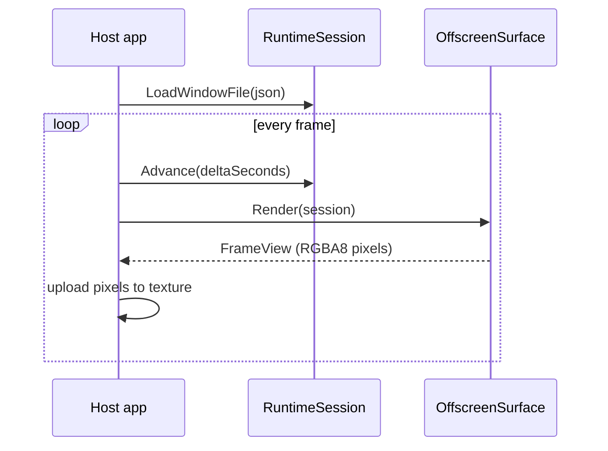

# Offscreen Embedding

When your application must render one MFD without launching `mfd_window`, use
the dedicated `mfd_runtime_api` package. It keeps the authored UDP in/out
contract, preserves clipping offscreen, and lets the host application resize each
offscreen surface explicitly.

## Build the example

```powershell
cmake --build --preset debug-win32 --target offscreen_viewer
```

Run `offscreen_viewer` from the staged build tree. The example loads one window
JSON through `mfd_runtime_api`, renders two independent offscreen surfaces, and
displays the uploaded images in a resizable host window — without using
`WindowLauncher` scripts.

## Minimal usage

`RuntimeSession` owns the authored window and its command/feedback contract;
`OffscreenSurface` owns one private render target and CPU readback buffer.
A host application creates one of each, advances the session every frame, and
renders into as many surfaces as it needs:

```cpp
#include "mfd/runtime_api/RuntimeSession.h"
#include "mfd/runtime_api/OffscreenSurface.h"

mfd::runtime_api::RuntimeSession session;
std::string error;
if (!session.LoadWindowFile("assets/windows/demo_pages_minimal.json", error))
{
    // handle error
}

mfd::runtime_api::OffscreenSurface surface(960, 540);

// each frame
session.Advance(deltaSeconds);
if (surface.Render(session))
{
    const mfd::runtime_api::OffscreenFrameView frame = surface.FrameView();
    // upload frame.pixels (frame.width x frame.height, RGBA8) to your texture
}
```

`OffscreenFrameView::Ready()` confirms the borrowed buffer may be sampled
before it is uploaded. Call `surface.Resize(width, height)` whenever your host
window changes size; the render target and CPU buffer follow automatically.



## When to use it

Choose offscreen embedding when:

- you own the host window and frame loop
- you need more than one independent MFD surface in the same process
- you want explicit control over each surface's size

The runtime keeps the same authored command and feedback contract as
`mfd_window`, so a client written against the generated API behaves identically
whether it targets the standalone host or your embedded surfaces.
