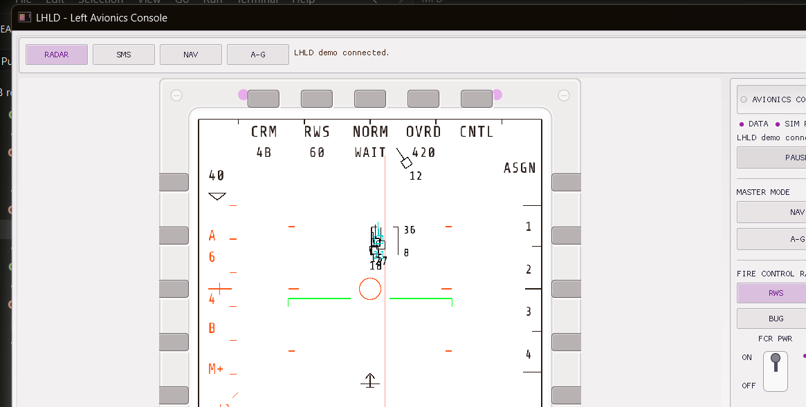

# MFDStudio Documentation

`MFDStudio` is a C++17 / CMake toolkit for authoring and running 2D
multi-function display (MFD) windows from JSON.

The historical technical prefix `mfd` remains in namespaces, targets, folders,
and APIs.

The gallery now includes the complete LHLD page set and the live HUD display,
captured from the shipped Win32 Debug applications.

-> [Open the visual gallery](./gallery.md) | [Explore LHLD](./handbook/lhld.md) | [Explore the HUD](./handbook/hud.md)

## Pick Your Path

You do not need to read this book linearly. Most users only need one path first.

| Goal | Start here |
| --- | --- |
| Launch a window and see something live | [Quick Start](./quickstart.md) |
| Follow one end-to-end walkthrough | [Getting Started Tutorial](./getting-started.md) |
| Understand the JSON model | [Concepts](./concepts.md) |
| Copy a short task-focused recipe | [Cookbook](./cookbook.md) |
| Drive a window from a generated C++ client | [Generated Client API](./handbook/generated_api.md) |
| Embed the runtime offscreen in your app | [Offscreen Embedding](./handbook/offscreen.md) |
| Capture raw runtime pixels | [Framebuffer Capture](./handbook/framebuffer.md) |
| Author assets visually | [Editor](./handbook/editor.md) |
| Explore the four-page avionics console | [LHLD](./handbook/lhld.md) |
| Integrate the reusable HUD runtime | [HUD](./handbook/hud.md) |
| Look up exact JSON fields | [JSON Syntax](./reference/json.md) |
| Know what is stable to depend on | [Public API Contract](./reference/public_contract.md) |
| Build, test, or contribute | [Build](./dev/build.md) |
| Browse the public C++ headers | [C++ API Reference](./api.md) |

A visual tour of the runtime, editor, and client is in the
[Gallery](./gallery.md).

## Main Applications

| Entry point | Purpose |
| --- | --- |
| `mfd_window` | Runtime host that loads one window JSON file |
| `demo_client` | Live UDP client to validate pages, reticles, blink, strobe, feedback |
| `hud_runtime` | Reusable DLL/shared library publishing the HUD from a `hud::HudInputSample` |
| `hud_client` | Dear ImGui + DirectX11 client consuming `hud_runtime` to drive the dedicated HUD asset |
| `mfd_editor` | Visual authoring tool for windows, pages, and reticles |
| `offscreen_viewer` | Example embedding `mfd_runtime_api` and displaying offscreen images |
| `mfd_framebuffer_stdout_plugin` | Sample framebuffer plugin for the `mfd_window` capture ABI |

## Where This Book Lives

- Source pages: `docs/src/`
- Published site: `build/docs/site`
- C++ API reference (Doxygen): [`/api/`](./api.md)
