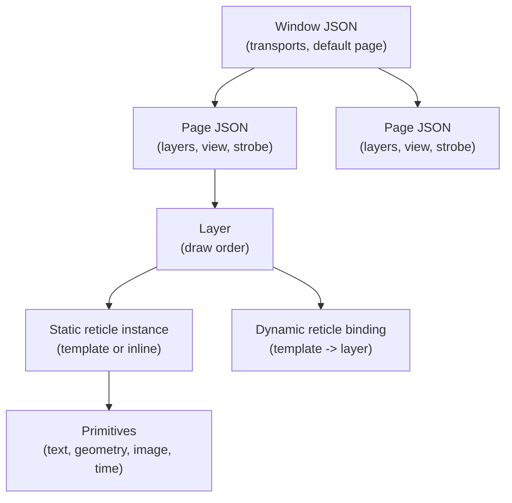

# Pages And Windows

Exact JSON fields for window files, page files, static reticle instances, and
strobe catalogs. See [JSON Syntax](./json.md) for shared conventions.

By convention, window files live in `assets/windows` and page files in
`assets/pages`.



One window owns several pages; one page owns ordered layers; each layer holds
static reticle instances and dynamic-reticle bindings, and each reticle is made
of primitives.

## Window JSON

```json
{
  "title": "Tutorial Window",
  "size": [1280, 800],
  "position": [80, 60],
  "targetFps": 60,
  "fontFile": "../fonts/ocr_a.ttf",
  "iconFile": "../../branding/mfdstudio_app_icon.png",
  "reticleLibraryFolder": "../reticles",
  "commands": { "udp": { "enabled": true, "address": "127.0.0.1", "port": 47300, "maxPacketSize": 16384 } },
  "feedback": {
    "udp": { "enabled": true, "address": "127.0.0.1", "port": 47301, "maxPacketSize": 4096 },
    "fastIntervalMs": 20,
    "heartbeatIntervalMs": 350
  },
  "defaultPage": "Radar",
  "pages": ["../pages/pfd.json", "../pages/radar.json"]
}
```

| Field | Required | Description |
| --- | --- | --- |
| `title` | no | Window title. |
| `size` (`[w,h]` or `{width,height}`) | recommended | Window pixel size. |
| `position` (`[x,y]` or `{x,y}`) | no | Initial screen position. |
| `targetFps` (alias `fps`) | no | Requested update rate. |
| `fontFile` | no | Font used for text primitives; resolved relative to this file. |
| `iconFile` | no | Native window icon; resolved relative to this file. |
| `reticleLibraryFolder` | recommended | Folder of reticle templates. |
| `commands` | no | UDP command transport. |
| `feedback` | no | UDP feedback transport plus cadence. |
| `defaultPage` | no | Page opened on load (must match a page name; else first page). |
| `pages` | yes | Page JSON files (strings or `{file/path/json}` objects). |

Numeric fields must be finite; pixel integers must fit a signed 32-bit int.

## Transports

Command and feedback share the same UDP fields:

| Field | Description |
| --- | --- |
| `enabled` | Enable the endpoint. |
| `address` | IPv4 bind/target. Keep `127.0.0.1` unless you want network exposure. |
| `port` | UDP port. |
| `maxPacketSize` | Payload size in `[64, 65507]`. |

> Binding to `0.0.0.0` exposes the runtime command surface to the local network.
> Do that only in trusted environments.

Feedback cadence fields live directly under `feedback`: `fastIntervalMs` /
`fastIntervalSeconds` (default `0.020`) for changed-state updates, and
`heartbeatIntervalMs` / `heartbeatIntervalSeconds` (default `0.350`, ≥ fast) for
unchanged-state heartbeats. `WindowLifecycleFeedback` emits a periodic `Alive`
heartbeat plus one final `Closing` payload; clients detect it with
`mfd::client::WindowLivenessMonitor`. Live strobe/capture state is reported only
for the active page.

## Page JSON

```json
{
  "name": "Radar",
  "title": "Radar",
  "backgroundColor": "#08131BFF",
  "layers": [ { "id": "base" }, { "id": "overlay" } ],
  "dynamicReticleBindings": [
    { "templateId": "radar_track", "layerId": "overlay", "orderInLayer": 0 }
  ],
  "blinkTypes": [ { "name": "slow", "durationMs": 1000 }, { "name": "fast", "durationMs": 320 } ],
  "defaultBlink": "slow",
  "view": { "center": [0.0, 0.0], "zoom": 1.0 },
  "activeStrobe": "Default",
  "strobes": [ { "name": "Default", "id": "radar_strobe_default", "template": "strobe_cursor", "capture": { "shape": "circle", "radius": 0.10 } } ],
  "staticReticles": [ { "id": "grid", "template": "radar_grid", "layerId": "base", "blink": "fast" } ]
}
```

| Field | Required | Description |
| --- | --- | --- |
| `name` / `id` | yes (one of) | Public page name used by the API. |
| `title` | no | Human-readable title. |
| `titleDisplay` | no | Authored title-chrome display state. |
| `backgroundColor` (`background`/`bg`) | no | Page background. |
| `layers` | yes | Ordered runtime layers; the draw-order source of truth. Each id non-empty and unique. |
| `dynamicReticleBindings` | no | Template→layer binding (`templateId`, `layerId`, unique `orderInLayer`). |
| `blinkTypes` (`blinks`) | no | Named page blink types. |
| `defaultBlink` | no | Default blink when a reticle enables blink without a type. |
| `view` | no | `center` + `zoom` (prefer nested form). |
| `activeStrobe` | no | Startup strobe selection. |
| `strobes` | no | Named strobe catalog. |
| `staticReticles` | no | Static reticles on the page. |
| `strobe` | no | Legacy single-strobe shorthand → one `Default` entry. |

Blink synchronizes per page by effective duration: two types with the same
`durationMs` blink in phase. Static reticle ids and strobe ids must be unique
within the page.

## Static reticle instance

A page reticle either instantiates a library template or defines an inline
reticle via `elements`.

```json
{
  "id": "status_clock",
  "template": "status_clock",
  "layerId": "overlay",
  "position": [0.62, 0.77],
  "stroke": "#EAD29BFF",
  "blink": "fast",
  "drawOnTop": true
}
```

Key fields: `id` (unique on page), `template` (or `elements` for inline),
`layerId` (required, must exist in `layers`), transform/style overrides,
`overrides`, `text`/`texts`/`letterSpacing`/`letterSpacings`, `drawOnTop` (alias
`onTop`), and `clipping`.

**Blink binding**: `"blink": true` (page default), `"blink": "fast"` (explicit
type), or `{ "enabled": false, "type": "slow" }` (keep a type while disabled).

**Clipping** is a stencil erase/mask behavior:

```json
"clipping": { "mode": "outer", "primitive": "ball_outer_circle" }
```

`mode` is `none`, `inner`, or `outer`; `primitive` is the mask id (geometry must
be `circle`, `rectangle`, `ellipse`, `square`, or `triangle`). Diagnostics:
`MFD014` missing primitive, `MFD015` unusable mask, `MFD016` empty id, `MFD017`
duplicate primitive ids, `MFD018` colliding reticle ids.

## Strobe catalog

Use `activeStrobe` for the startup selection and `strobes` for the named entries.
Each entry is a reticle definition plus `capture` and optional `magnet`:

```json
{
  "name": "Default",
  "id": "radar_strobe_default",
  "template": "strobe_cursor",
  "position": [0.0, 0.0],
  "capture": { "shape": "circle", "radius": 0.10 },
  "magnet": { "enabled": true, "radius": 0.075, "strength": 1.0 }
}
```

- **`capture`** — `shape` (`circle`/`rectangle` family), `radius` (circular),
  `size`/`width`/`height` (rectangular).
- **`magnet`** — `enabled`, `radius`, `strength` (`[0,1]`), and an optional
  `visual` cue (`circle`/`square`, drawn only while magnetized). `"magnet": true`
  enables defaults.

Template entries may omit `id` to reuse the `template` id; inline entries (using
`elements`) must declare an explicit `id`. The legacy singular `strobe` object is
normalized into a single-entry `strobes` catalog.

## Recommended style

Prefer `name` for pages, a nested `view` object, page-level `blinkTypes` +
`defaultBlink`, `blink` only on instances/strobe entries, `staticReticles` +
`template` for reuse, `activeStrobe` + `strobes` for new content, and canonical
transform/style field names throughout.
