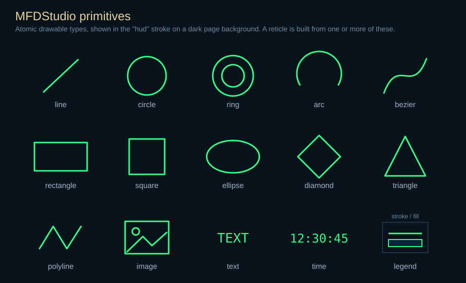

# Primitives

Supported primitive types and their JSON fields. For transform, color, and style
syntax see [JSON Syntax](./json.md).

## Visual overview



Every type above is drawn from the same normalized `[-1, 1]` space and styled
with the shared stroke/fill conventions. A reticle composes one or more of these
primitives.

## Common fields

Every primitive supports these:

| Field | Type | Description |
| --- | --- | --- |
| `id` | string | Identifier inside the reticle (recommended). |
| `type` | string | Primitive type (required). |
| `position` / `x` / `y` | vec2 / number | Local translation. |
| `rotationDegrees` | number | Local rotation. |
| `scale` | number or vec2 | Local scale. |
| `visible` | bool | Visibility. |
| `exposed` | bool | Exposes the primitive to the generated client API. |
| `reticleRotationSensitive` | bool | Apply parent reticle/strobe rotation (default `true`). |
| `reticleScaleSensitive` | bool | Apply parent reticle/strobe scale (default `true`). |
| `stroke` / `thickness` / `lineStyle` | — | Outline style. |
| `filled` / `fill` | bool / color | Fill state, for fill-capable primitives only. |

Set `reticleRotationSensitive` or `reticleScaleSensitive` to `false` to keep a
primitive upright or fixed-size while its reticle rotates or scales. Exposed
primitives can always be patched directly through the generated client API.

## Types and aliases

| Canonical | Aliases |
| --- | --- |
| `text` | — |
| `time` | `clock`, `heure` |
| `line` | — |
| `circle` | — |
| `ring` | `annulus`, `donut` |
| `rectangle` | `rect`, `box` |
| `ellipse` | `oval` |
| `square` | — |
| `diamond` | — |
| `triangle` | — |
| `polyline` | — |
| `bezier` | — |
| `arc` | — |
| `image` | `picture`, `sprite` |

## Per-type fields

- **`text`** — `text`, `fontSize` (alias `size`), `letterSpacing`
  (`spacing`/`tracking`), `align` (`left`/`center`/`right`, default `center`).
- **`time`** — `format` (alias `pattern`, `strftime`-style), `utc` (alias
  `useUtc`), plus the same font/spacing/align fields as `text`.
- **`line`** — `start` (alias `from`), `end` (alias `to`).
- **`circle`** — `radius`.
- **`ring`** — `outerRadius` (alias `radius`), `innerRadius` (alias
  `holeRadius`), `bandWidth` (alias `ringWidth`), `segments`.
- **`rectangle`** — `width`, `height`, `size` (uniform fallback).
- **`ellipse`** — `width`, `height`, `radiusX`/`radiusY` (`rx`/`ry`), `radius`.
- **`square`** — `size` (single uniform side length). A square is never
  deformable: legacy `width`/`height` keys are accepted only as a fallback side
  source and are forced equal on load, and the editor exposes a single side
  control.
- **`diamond`** — `size`, `width`, `height`.
- **`triangle`** — `points` (exactly three).
- **`polyline`** — `points` (≥ 2), `closed`. Closed + filled renders the polygon
  (convex/concave; not self-intersecting).
- **`bezier`** — `controlPoints` (alias `points`, 2–64), `segments`. Larger
  control sets are rejected at load; chain lower-degree curves instead.
- **`arc`** — `radius`, `startAngleDegrees`, `endAngleDegrees`, `segments`.
  `filled` renders a sector from the center.
- **`image`** — `file` (aliases `image`, `source`, `path`), `size`, `width`,
  `height`. Paths resolve relative to the referencing page/reticle JSON.

## Examples

```json
{
  "id": "track_label",
  "type": "text",
  "text": "AF042",
  "position": [0.10, 0.04],
  "fontSize": 0.035,
  "align": "right",
  "stroke": "hud"
}
```

```json
{
  "id": "adi_bezel",
  "type": "ring",
  "innerRadius": 0.29,
  "outerRadius": 0.40,
  "filled": true,
  "fill": "#0A1119FF",
  "stroke": "#6A8DA6FF"
}
```

```json
{
  "id": "scan_arc",
  "type": "arc",
  "radius": 0.24,
  "startAngleDegrees": -45.0,
  "endAngleDegrees": 135.0,
  "segments": 40
}
```

## Recommendations

- give every primitive an `id`
- set geometric sizes explicitly
- prefer canonical field names over aliases
- prefer `width`/`height` for `rectangle` and `ellipse`
- prefer `controlPoints` for `bezier`, `startAngleDegrees`/`endAngleDegrees` for `arc`
