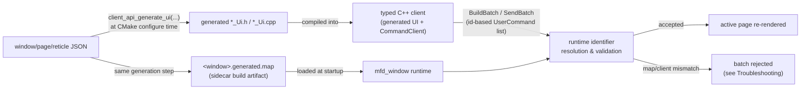

# Public API Contract

What you can depend on, what is internal, and what may change between versions.
This page is the stability reference; the [Architecture](../dev/architecture.md)
page explains why the boundaries are drawn where they are.

## What is stable

These are the supported surfaces for external use:

- **The window/page/reticle JSON model** — the authoring contract documented in
  the [Reference](./json.md) section. Field names and accepted aliases are the
  public authoring language.
- **The packaged client SDK** — consumed with
  `find_package(MFDStudioClientApi)` and linked as `MFDStudio::ClientApi`. It
  ships only the headers and import libraries a generated client needs.
- **The two client umbrella headers** — `mfd/client/ClientSdk.h` for standalone
  applications and shipped examples, and `mfd/client/GeneratedUiSupport.h` for
  generated source files.
- **The offscreen runtime package** — `mfd_runtime_api` (`RuntimeSession`,
  `OffscreenSurface`) for embedding without `mfd_window`.
- **The framebuffer plugin ABI** — `mfd_window_plugin_api`, the stable boundary
  for capturing `mfd_window` output and reading the host launch arguments
  forwarded during plugin initialization, including arguments outside the
  window launcher contract.
- **The UDP command and feedback contract** — the same wire behavior whether a
  client targets standalone `mfd_window` or an embedded `mfd_runtime_api`
  surface.

## What is internal

Do not depend on these from external code; they can change without notice:

- core targets and headers behind the SDK boundary, such as `mfd_api.lib`,
  `SceneRegistry.h`, `CommandProcessor.h`, and the host-side render layer
  (`mfd::render_raylib`)
- the `mfd::api` umbrella name (a historical convenience, not a delivery)
- internal command pipeline stages, registries, and batching internals
- the editor's internal authoring model and preferences

The packaged client SDK is deliberately curated: external consumers receive the
generated-client surface only, **not** the core libraries above.

## The three roles you depend on

### JSON — the authored contract

The window, page, and reticle JSON files define what exists: pages, layers,
static reticles, exposed primitives, strobes, dynamic bindings, and transports.
JSON is the source of truth; the editor and hand-authoring both produce it.

### The generated client API — the typed surface

For a client that targets one known window, the generator turns its JSON into a
typed `*_Ui` class with handles for pages, reticles, exposed primitives,
strobes, and dynamic sets. Generate it at configure time with
`client_api_generate_ui(...)`. Prefer this surface; use raw name-based
`CommandClient` helpers only for generic tooling or low-level debugging.

### The `.generated.map` — the runtime sidecar

`client_api_generate_ui(... OUTPUT_MAP <window>.generated.map ...)` emits a
sidecar next to the window JSON. It is a **build artifact**, regenerated from the
JSON, and is not meant to be edited by hand.

## Compatibility between runtime, map, and client

Treat the generated header, the generated source, and the `.generated.map` as
**one contract**:

- the client uses the map for raw-name fallback helpers
- `mfd_window` must load the matching `.generated.map` to accept generated
  id-based batches
- runtime feedback sent by `mfd_window` contains numeric transport/runtime ids
  only; it has no name-based identity fallback
- if the generated C++ and the map drift apart, or the runtime loaded no/old
  sidecar, generated batches are **rejected**

The full cycle, from authored JSON to a rendered frame:

- **Where the map is produced.** `client_api_generate_ui(... OUTPUT_MAP
  <window>.generated.map ...)` emits it next to the window JSON at CMake
  configure time, in the same step that emits the generated header/source.
- **How it is linked to JSON.** The map is derived purely from the window's
  page/reticle/primitive ids; it has no independent authored content and is
  not meant to be hand-edited.
- **How the runtime loads it.** `mfd_window` reads the sidecar that sits next
  to the window JSON it was launched with. There is no version negotiation:
  it is either the matching map or a stale one.
- **How the generated client uses it.** The generated `*_Ui` class and
  `CommandClient` use the map for raw-name fallback and for the id-based
  command encoding the runtime expects.
- **What to redo after a JSON change.** Re-run CMake configure (or rebuild the
  generation step) so the header, source, and map are regenerated together,
  then re-launch `mfd_window` so it loads the fresh map. Regenerating only the
  client, or only reloading the runtime, reintroduces drift.
- **Diagnosing a stale or mismatched map.** See
  [Generated batches are rejected](../handbook/troubleshooting.md#generated-batches-are-rejected)
  and [`.generated.map` missing or stale](../handbook/troubleshooting.md#generatedmap-missing-or-stale)
  in Troubleshooting for symptoms and the fix.

The rule of thumb: regenerate the client and the map together from the same
window JSON, and ship the map beside the window the runtime loads.

## What can break between versions

- internal headers and targets behind the SDK boundary (by design)
- a `.generated.map` that no longer matches a regenerated client
- authored JSON that relied on undocumented or non-canonical behavior — prefer
  canonical field names over aliases to stay forward-compatible

Names remain meaningful in authored JSON and in the raw `CommandClient` helper
surface. Across the generated transport boundary, command routing and runtime
feedback identity use numeric ids from the matching generated contract. Feedback
strings are limited to business data such as capture labels, categories, and
metadata; they are never used to identify a page, strobe, reticle, or template.

## Rules when adding a command or a primitive

Contributors extending the runtime must keep behavior consistent across the
**whole pipeline**, not just at the definition site:

> command type definition → validation → protobuf serialization → generated
> identifier detection → client transport normalization → runtime identifier
> resolution → runtime dispatch → batching/coalescing → tests

Practical rules:

- centralize a rule in a command helper or trait instead of duplicating it
  across client, processor, serializer, batching, and tests
- validate every input boundary (JSON, UDP, Protobuf, plugins, editor, API) for
  bounds, types, ids, enums, strings, paths, and non-finite values
- a new exposed primitive must be reachable through the generated surface and
  covered by tests
- keep the public client SDK minimal; do not widen it without need

See [`AGENTS.md`](https://github.com/benoitfragit/MFDStudio/blob/master/AGENTS.md)
for the full contributor contract and the [Quality](../dev/quality.md) page for
the review bar.
