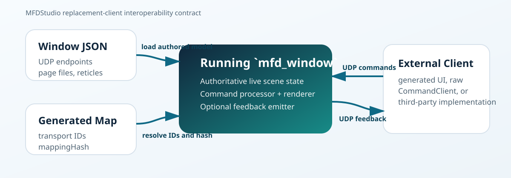
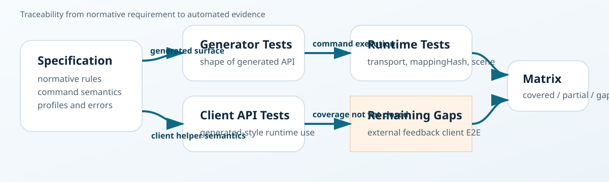

# MFDStudio External Client Interoperability Specification

Status: Draft 0.1  
Aligned release baseline: MFDStudio 1.1.7  
Intended audience: external client implementers, integrators, reviewers, and future normalization work

## 1. Purpose

This document defines the client-side interoperability contract required to
control a running MFDStudio window from an external application.

Its goal is to let a third party replace the shipped clients with an
independent implementation while remaining compatible with the runtime
behavior, transport contract, and public command model.

This document is written as a normative specification candidate. It therefore:

- distinguishes required behavior from recommendations
- describes stable concepts before implementation details
- defines conformance profiles and testable expectations

## 2. Scope

This specification defines:

- the client-to-window command model
- the transport discovery model exposed by window JSON
- the role of the companion generated transport map
- the optional generated client UI and primitive-binding layer
- the command batch contract
- the semantics of the public runtime commands
- the optional strobe feedback profile
- the minimum conformance checks for a replacement client

This specification does not define:

- renderer internals
- editor workflows
- framebuffer capture plugins
- the internal implementation of the shipped example applications
- the full JSON authoring syntax for every asset type

Those topics are covered elsewhere in the documentation and remain informative
for this specification.

## 3. Normative Language

The key words `MUST`, `MUST NOT`, `REQUIRED`, `SHOULD`, `SHOULD NOT`,
`RECOMMENDED`, `MAY`, and `OPTIONAL` in this document are to be interpreted as
described in RFC 2119 style usage.

Unless explicitly marked as informative, the statements in Sections 4 to 15 are
normative.

## 4. Reference Model

The interoperability model is based on four artifacts:

1. one authored window JSON file
2. one running runtime window that renders and owns the live scene state
3. one optional companion generated transport map
4. one external client that sends commands and may receive feedback

At runtime:

- the window owns the rendered scene and authoritative runtime state
- the client owns external data and interaction intent
- the transport carries typed commands, not renderer internals

In the normal deployment model:

- the window listens for command UDP packets
- the client sends Protocol Buffers command batches over UDP
- the window may emit UDP strobe feedback snapshots back to the client



## 5. Terminology

This specification uses the following terms:

- `window`: one runtime host created from one root window JSON file
- `page`: one logical display page owned by a window
- `static reticle`: one authored reticle instance already present in a page
- `dynamic reticle`: one runtime-created instance derived from an authored
  template
- `template`: one authored reticle definition that can instantiate dynamic
  reticles
- `primitive`: one visible primitive inside a reticle or template
- `transport map`: the companion `.generated.map` file mapping authored names to
  transport IDs
- `mappingHash`: the hash proving that the client and the window use the same
  authored-name to transport-ID mapping
- `replacement client`: any external client implementation that is not one of
  the shipped MFDStudio example clients

## 6. Conformance Profiles

This specification defines four practical conformance profiles.

### 6.1 Profile A - Control Client

A Profile A client MUST support:

- endpoint discovery or equivalent static configuration
- `ActivatePageCommand`
- `SetPageViewCommand`
- `UpdateWindowDisplayCommand`
- `UpdateReticleCommand`
- `ResetWindowCommand`

### 6.2 Profile B - Dynamic Data Client

A Profile B client MUST satisfy Profile A and MUST also support:

- `UpsertDynamicReticleCommand` or `UpsertDynamicReticlesCommand`
- `RemoveDynamicReticleCommand`
- `SetDynamicReticleSetVisibilityCommand`
- `mappingHash` handling when generated IDs are used

### 6.3 Profile C - Interactive Feedback Client

A Profile C client MUST satisfy Profile B and MUST also support:

- `UpdateStrobeCommand`
- optional UDP strobe feedback reception and decoding
- treating window feedback as authoritative for resolved strobe state

### 6.4 Profile D - Generated UI Binding Client

A Profile D implementation MUST satisfy Profile B and MUST also expose an
ergonomic generated binding layer equivalent in role to the shipped generated
client UI.

At minimum, a Profile D implementation MUST:

- expose typed navigation from a generated UI root to pages, reticles, and
  primitives
- expose primitive-kind-specific handles for exposed primitives whenever the
  authored primitive kind is known
- expose one page-scoped strobe handle when the authored page model supports it
- expose one typed dynamic-set accessor per authored dynamic template
- hide transport IDs from normal application code
- provide batch-building helpers that preserve the generated `mappingHash`

## 7. Discovery Artifacts

### 7.1 Window JSON

A conforming client deployment MUST know the command endpoint of the target
window.

The RECOMMENDED source of truth is the target window JSON:

```json
"commands": {
  "udp": {
    "enabled": true,
    "address": "127.0.0.1",
    "port": 47220,
    "maxPacketSize": 16384
  }
}
```

The client MAY obtain equivalent values from a deployment system or manual
configuration instead of reading the JSON file directly.

### 7.2 Generated Transport Map

If a client addresses pages, reticles, templates, blink types, or primitives by
authored name, it MUST use the matching generated transport map or an
equivalent authoritative ID source.

If a client already knows the generated transport IDs and the matching
`mappingHash`, it MAY skip loading the transport map file.

The generated transport map is therefore:

- REQUIRED for name-based interoperability
- OPTIONAL for fully ID-based interoperability

### 7.3 Generated Client API and UI Binding Layer

The generated client API is not the wire protocol, but it is still an official
integration surface of MFDStudio.

A replacement client does not need to reuse the generated C++ code as long as
it obeys the command, identifier, and transport rules defined here.

However, any implementation claiming compatibility with the generated UI layer
MUST preserve the following client-facing model:

- `ui -> page -> reticle -> primitive`
- `page -> strobe`
- `page -> dynamic set -> dynamic reticle -> primitive`

For this specification, the generated primitive-level API is part of the
official compatibility surface, not only a convenience wrapper.

That means compatibility is evaluated not only at the raw command level, but
also at the generated typed-navigation level exposed to application code.

The generated UI layer therefore sits above the transport contract and below the
application domain code:

- application code mutates typed handles
- the generated UI layer converts those mutations into commands
- the transport layer serializes and sends the resulting `CommandBatch`
- generated application code is expected to mutate primitive handles rather than
  reach for string-based primitive setters in normal usage

### 7.4 Generated Binding Contract

If an implementation exposes a generated UI layer, the following rules apply:

- normal application code MUST NOT manipulate transport IDs directly
- the generated root MUST provide a `BuildBatch()`-style helper returning the
  current command list
- the generated root MUST provide a `BuildCommandBatch(sequence)`-style helper
  carrying the generated `mappingHash`
- a `SubmitLatest(publisher, sequence)`-style helper, if exposed, MUST be
  semantically equivalent to `publisher.SubmitLatest(BuildCommandBatch(sequence))`
- generated page strobe access MUST remain page-scoped
- generated dynamic reticle access MUST remain handle-based rather than
  user-supplied-runtime-id-based
- a generated `Reset()` helper MUST be treated as a local staging reset, not as
  a substitute for `ResetWindowCommand`

### 7.5 Primitive-Level Generated Surface

If an implementation exposes a generated UI layer, each exposed authored
primitive MUST be reachable from its owning generated reticle or generated
dynamic reticle through one typed accessor.

The implementation MUST emit the most specific generated primitive handle type
that matches the authored primitive kind when that kind is supported by the
public client API.

Expected examples include:

- `TextHandle`
- `TimeHandle`
- `LineHandle`
- `CircleHandle`
- `RingHandle`
- `RectangleHandle`
- `EllipseHandle`
- `SquareHandle`
- `DiamondHandle`
- `PrimitiveHandle` only as a fallback when no more specific public handle type
  exists

Normative rules:

- static generated reticles MUST expose typed primitive accessors for every
  exposed authored primitive
- generated dynamic reticles MUST expose the same typed primitive accessors for
  primitives authored on the backing template
- mutating one generated primitive handle MUST result in primitive-level patch
  data, not in unrelated whole-reticle fallback behavior
- when generated primitive IDs are available, the emitted primitive-level patch
  SHOULD resolve to generated primitive IDs rather than remain name-only
- generated application code SHOULD prefer these typed primitive accessors over
  low-level string-based primitive patch helpers

## 8. Transport Profile

### 8.1 Command Transport

This specification defines one normative transport profile for command
interoperability:

- Protocol Buffers payloads over UDP

The window JSON exposes:

- `address`
- `port`
- `maxPacketSize`

A conforming client MUST:

- send command payloads to the configured UDP endpoint
- respect the configured `maxPacketSize`
- preserve `sequence` and `mappingHash` when splitting one logical command cycle
  across several UDP payloads

### 8.2 Feedback Transport

If the window exposes:

```json
"feedback": {
  "udp": {
    "enabled": true,
    "address": "127.0.0.1",
    "port": 47221,
    "maxPacketSize": 4096
  }
}
```

then a Profile C client MAY receive strobe feedback on that UDP endpoint.

### 8.3 Reliability Model

UDP is inherently datagram-based and non-transactional.

A conforming client MUST assume:

- packets may be lost
- packets may be delayed
- packets may arrive out of order

The runtime command model is therefore state-oriented rather than
acknowledgement-oriented. Clients SHOULD regularly publish the latest relevant
state instead of relying on single-shot reliability.

## 9. Coordinate and Value Model

Unless otherwise documented for a specific field:

- page-space positions use logical coordinates in the `[-1, 1]` range
- rotations are expressed in degrees
- brightness is a normalized factor in the `[0, 1]` range
- strobe positions are page-scoped logical coordinates

Clients SHOULD clamp or sanitize obviously invalid values before sending them.
The runtime remains authoritative for its own safety checks.

## 10. Identifier Model

### 10.1 Authored Names

Authored names are human-readable identifiers such as:

- page names
- static reticle IDs
- dynamic template IDs
- primitive IDs
- blink type names

These names are convenient in high-level clients but are not the normative
on-wire identity when generated IDs are available.

### 10.2 Generated Transport IDs

Generated transport IDs are deterministic 64-bit identifiers derived from the
authored model and exported by the generated transport map.

When a command uses generated IDs, the client MUST send the matching
`mappingHash` in the surrounding `CommandBatch`.

### 10.3 Dynamic Runtime IDs

Dynamic reticles are identified on the wire by `runtimeReticleId`.

For dynamic reticles:

- `reticleId` is only a local convenience alias
- `runtimeReticleId` is the authoritative transport identity
- the runtime MAY expose hidden alias forms internally

A replacement client MUST treat `runtimeReticleId` as the stable transport
identity of a dynamic instance.

## 11. Command Batch Contract

`CommandBatch` is the unit of one external update cycle.

It contains:

- `sequence`
- `mappingHash`
- `commands`

Normative rules:

- a client MAY leave `sequence` at `0` if it does not track an external cycle
- a client SHOULD use one stable `sequence` value per external update cycle
- a client MUST provide a non-empty `mappingHash` whenever one command uses
  generated IDs
- a runtime MUST reject a generated-ID batch whose `mappingHash` does not match
  the loaded transport map
- a runtime MUST reject generated-ID commands received without `mappingHash`

## 12. Command Semantics

This section defines the expected meaning of each public command family.

| Command | Required effect |
| --- | --- |
| `ActivatePageCommand` | make the addressed page active |
| `SetPageViewCommand` | update page center and zoom |
| `UpdateWindowDisplayCommand` | update whole-window visual state |
| `UpdateReticleCommand` | apply a partial patch to one static reticle |
| `UpdateStrobeCommand` | update strobe activation and/or requested position |
| `UpsertDynamicReticleCommand` | create or update one dynamic reticle |
| `UpsertDynamicReticlesCommand` | create or update many dynamic reticles from one template |
| `SetDynamicReticleSetVisibilityCommand` | set visibility for all dynamic reticles of one page/template set |
| `RemoveDynamicReticleCommand` | remove one dynamic reticle instance |
| `ResetWindowCommand` | restore the runtime to the authored initial state |

### 12.1 ActivatePageCommand

A conforming client MAY activate a page by authored name or by generated page
ID.

Expected behavior:

- the target page becomes the active page
- no other runtime state is implicitly reset

Clients SHOULD send page activation on context change, not every frame.

### 12.2 SetPageViewCommand

This command updates the current view state of one page:

- logical center
- zoom

It MUST NOT be interpreted as a page activation command.

### 12.3 UpdateWindowDisplayCommand

This command updates whole-window display properties such as:

- color inversion
- brightness
- blackout or disabled state

It applies to the rendered output, not to the authored document itself.

### 12.4 UpdateReticleCommand

This command applies a `ReticlePatch` to one addressed static reticle.

A client MAY patch only a subset of fields. Unspecified fields MUST be treated
as unchanged.

If the patch uses:

- named blink types
- named primitive text overrides
- named primitive letter spacings
- named primitive sub-patches

then the client MUST provide enough transport mapping context to resolve those
names before serialization.

### 12.5 UpdateStrobeCommand

This command is page-scoped and updates:

- optional active state
- optional requested position

The command expresses intent only. The runtime remains authoritative for the
resolved final strobe state after magnetization and capture logic.

### 12.6 UpsertDynamicReticleCommand

This command creates a missing dynamic reticle or updates an existing one.

When creation is needed:

- the template identity MUST be provided
- the dynamic instance MUST be identified by `runtimeReticleId` on the wire

### 12.7 UpsertDynamicReticlesCommand

This command performs the same semantic action as repeated
`UpsertDynamicReticleCommand` operations, but for many reticles of the same
template inside the same update cycle.

A conforming client SHOULD prefer this bulk form for high-rate loops and radar-
A conforming client SHOULD prefer this bulk form for high-rate loops and
radar-style workloads.

### 12.8 SetDynamicReticleSetVisibilityCommand

This command toggles visibility for the dynamic reticle set defined by one page
and one template.

It MUST affect only reticles belonging to that page/template set.

### 12.9 RemoveDynamicReticleCommand

This command removes one addressed dynamic reticle instance.

Removal MUST target the dynamic runtime identity, not only a local alias.

### 12.10 ResetWindowCommand

This command restores the runtime to its authored initial state.

The runtime reset includes:

- active page selection
- page views
- whole-window display parameters
- dynamic reticles
- strobe runtime state

## 13. Dynamic Reticle Rules

Dynamic reticles are the core compatibility boundary for high-rate clients.

A conforming dynamic-data client MUST follow these rules:

- use authored templates as the source of dynamic instances
- preserve one stable runtime identity per external logical object
- update an existing logical object with the same runtime identity
- remove the runtime identity when the logical object disappears

For generated client APIs, hidden runtime IDs may be managed internally by the
generated dynamic set. That behavior is informative but compatible with this
specification.

For raw replacement clients, a stable runtime identity strategy is REQUIRED.

### 13.1 Generated Dynamic Set Rules

If a generated UI layer is exposed, one typed dynamic-set accessor MUST exist
for each authored dynamic template.

For such generated dynamic sets:

- `Create()` MUST allocate and retain a hidden runtime dynamic identity
- `Remove(handle)` MUST remove the instance referenced by the typed handle
- application code MUST NOT be required to provide the runtime dynamic ID
- primitive-level typed access on the generated dynamic reticle SHOULD remain
  available when the authored template exposes primitives
- primitive-specific handle kinds SHOULD be preserved on generated dynamic
  reticles instead of collapsing everything to one generic primitive wrapper

## 14. Optional Strobe Feedback Profile

If feedback UDP is enabled, the window MAY emit `StrobeStatusFeedback`.

Important fields are:

- `sequence`
- `pageName`
- `strobeId`
- `active`
- `position`
- `capture`
- `magnet`
- optional `captureResult`

Normative rules:

- a feedback-capable client MUST treat feedback as the resolved runtime state
- a feedback-capable client MUST NOT assume the resolved strobe position equals
  the requested position
- if magnetization is enabled, the feedback position MAY snap to a dynamic
  target
- if capture is active, `captureResult` MAY describe the captured target

## 15. Error Handling and Mismatch Rules

A conforming client MUST surface at least the following interoperability
failures clearly:

- command transport unavailable
- feedback transport unavailable when feedback is expected
- generated transport IDs used without `mappingHash`
- `mappingHash` mismatch between client batch and window runtime
- missing transport map when name-based helpers require generated resolution
- invalid command payload rejected by the runtime

Clients SHOULD log enough context to identify:

- target page
- target reticle or template
- external cycle sequence when available
- whether the failing path was name-based or ID-based

## 16. Recommended Integration Modes

### 16.1 Mode A - Generated Client API

Use this mode when:

- you control the C++ integration
- you want typed accessors instead of strings
- you want the generated layer to hide transport IDs

### 16.2 Mode B - Raw CommandClient With Transport Map

Use this mode when:

- you want to use authored names directly
- you can load the window JSON and companion generated map locally
- you want high readability with low protocol risk

### 16.3 Mode C - Fully ID-Based Client

Use this mode when:

- your system already distributes generated IDs and `mappingHash`
- you want the leanest external integration
- you do not want the client to parse the authored asset files

### 16.4 Mode D - Generated UI Binding

Use this mode when:

- you want the official typed page and primitive navigation model
- you want transport IDs hidden from application code
- you want generated dynamic sets to own runtime dynamic IDs internally
- you want `BuildBatch()` and `BuildCommandBatch(sequence)` as the normal
  application-to-transport bridge

## 17. Minimal Replacement-Client Checklist

An implementation claiming replacement-client interoperability SHOULD pass the
following checks against a known target window:

| Check | Expected result |
| --- | --- |
| create command transport | client reports ready |
| activate one page | target page becomes active |
| send one page view | center and zoom update correctly |
| patch one static reticle | visible runtime change occurs without unrelated mutation |
| send one bulk dynamic reticle batch | all expected dynamic reticles appear or update |
| remove one dynamic reticle | target dynamic reticle disappears |
| toggle one dynamic set visibility | only the matching page/template set is affected |
| send one reset command | runtime returns to authored initial state |
| send one strobe update | requested strobe intent is applied |
| receive one strobe feedback packet | decoded resolved state matches window behavior |

For radar-like workloads, a conformance test SHOULD also cover one batch of at
least 100 dynamic reticle updates during the same cycle.

If the implementation claims generated UI compatibility, the conformance target
SHOULD also verify:

| Check | Expected result |
| --- | --- |
| generated UI root exposes page accessors | typed page navigation is available |
| generated reticle and primitive accessors exist | authored exposed objects are reachable without string lookup |
| generated primitive handles stay type-specific | text, line, ring, rectangle, and other supported primitive kinds expose dedicated handle types |
| generated strobe handle remains page-scoped | no strobe transport object is required from application code |
| generated dynamic set hides runtime IDs | `Create()` and `Remove(handle)` work without user-managed runtime IDs |
| generated batch helper carries `mappingHash` | `BuildCommandBatch(sequence)` emits the generated hash |
| generated submit helper preserves batch semantics | `SubmitLatest(...)` forwards the same logical batch |

### 17.1 Requirement-To-Test Traceability

The specification is intended to be traceable to automated evidence, not only
to prose. The conformance matrix is the operational companion that records
which requirements are already covered, which ones are only partially covered,
and which ones still require dedicated tests.



This traceability split is deliberate:

- the specification defines the interoperability contract
- the conformance matrix links that contract to repository tests
- gaps remain visible until they are backed by an automated check

## 18. Implementation Guidance

This section is informative.

Practical recommendations:

- prefer `SendBatch()` for synchronized multi-object updates
- treat UDP command emission as a realtime state stream, not as a request/reply
  API
- keep one stable logical-object to runtime-ID mapping on the client side
- separate transport discovery, scene data production, and UDP emission in your
  client architecture
- validate the companion transport map early during startup if you use authored
  names

## 19. Example Integration Snippets

### 19.1 Generated Page Client

```cpp
#include "FullDemoMockupUi.h"
#include "mfd/control/CommandClient.h"
#include "mfd/io/JsonLoader.h"

mfd::JsonLoader loader;
const auto loaded = loader.LoadWindowConfiguration("assets/windows/demo_pages.json");

if (!loaded.window.commandTransports.udp.has_value() || !loaded.generatedTransportMap.has_value())
{
    return 1;
}

mfd::CommandClient client(*loaded.window.commandTransports.udp, loaded.generatedTransportMap);
if (!client.IsReady())
{
    return 1;
}

full_demo_ui::FullDemoMockupUi ui;
client.ActivatePage(ui.Radar());
```

Generated page wrappers expose the stable page transport id to `CommandClient`.
The serialized command carries the page id and mapping hash. Raw name-resolving
helpers remain available for generic tooling, but they are a compatibility
surface rather than the preferred generated-client workflow.

### 19.2 Bulk Dynamic Update Cycle

```cpp
std::vector<mfd::DynamicReticleState> reticles;

for (const Track& track : tracks)
{
    mfd::ReticlePatch patch;
    patch.visible = true;
    patch.position = mfd::Vec2 {track.x, track.y};
    patch.rotationDegrees = track.headingDegrees;
    patch.texts.emplace("track_label", track.label);

    reticles.push_back(mfd::DynamicReticleState {track.runtimeAlias, track.runtimeId, std::move(patch)});
}

mfd::UpsertDynamicReticlesCommand command;
command.page = "Radar";
command.templateId = "radar_track";
command.reticles = std::move(reticles);

mfd::CommandBatch batch;
batch.sequence = frameSequence;
batch.commands.push_back(std::move(command));

client.SendBatch(batch);
```

### 19.3 Strobe Feedback Receiver

```cpp
auto feedbackChannel = mfd::CreateFeedbackReceiverChannel(feedbackUdp);
const auto payload = feedbackChannel->TryReceive();
if (payload.has_value())
{
    const auto feedback =
        mfd::DeserializeStrobeStatusFeedback(
            std::string_view(reinterpret_cast<const char*>(payload->data()), payload->size()));
}
```

## 20. Related Documents

The following documents are informative companions to this specification:

- [Documentation Guide](../README.md)
- [Client Conformance Matrix](./mfd_client_conformance_matrix.md)
- [Core Concepts](../CONCEPTS.md)
- [Generated Client API Architecture](../architecture/generated_client_api.md)
- [Drive A Window From A Live Client](../tutorials/04_drive_a_window_from_a_live_client.md)
- [Control The Strobe And Receive Feedback](../tutorials/06_strobe_control_and_feedback.md)
- [Use The Mockup As A Client API Reference](../tutorials/11_use_the_mockup_as_a_client_api_reference.md)
- [Generated Transport Map Specification](../architecture/generated_transport_map.md)

## 21. Candidate Evolution Path

This section is informative.

The document is intentionally written so it can later evolve toward:

- a repository-level interoperability standard
- a contract backed by an automated conformance suite
- a stronger AFNOR Spec or equivalent standardization artifact

The next recommended work items are:

1. add an explicit requirement-to-test matrix
2. version the conformance profiles independently from release notes
3. publish reference payload examples and negative examples
4. add automated conformance tests for third-party client implementations
