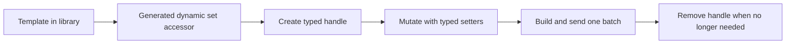

# Add And Remove Dynamic Reticles

This tutorial shows the preferred generated-client workflow for dynamic
reticles.

The important rule is now simple:

- generated client code hides the internal dynamic reticle ids
- application code keeps the returned typed handles instead
- low-level id-based commands remain available only when you explicitly choose
  the raw `CommandClient` API

## At A Glance



Dynamic reticles are ideal for:

- radar detections
- tracks
- route points
- temporary symbols

## Step 1 - Prepare one reusable template

Dynamic reticles still come from one authored template in the reticle library.

For example, the project already provides `radar_track` in
`assets/reticles/radar_track.json`.

The authored template stays the source of truth for geometry and exposed
primitive names.

## Step 2 - Obtain the generated dynamic set

With generated client bindings, you start from the page accessor:

```cpp
#include "MinimalRadarMockupUi.h"

minimal_radar_ui::MinimalRadarMockupUi ui;
auto& tracks = ui.Radar().DynamicRadarTrack();
std::vector<minimal_radar_ui::RadarTrackDynamicReticle*> activeTracks;
```

`tracks` owns the hidden runtime-scoped integer identifiers internally.

Your application only keeps the returned typed handles.

## Step 3 - Create one dynamic reticle without inventing an id

```cpp
auto& track = tracks.Create();
track.SetVisible(true);
track.SetPosition({0.25f, 0.10f});
track.SetRotationDegrees(15.0f);
track.SetColor({77, 224, 255, 255});
track.TrackLabel().SetText("T42");

activeTracks.push_back(&track);
client.SendBatch(ui.BuildBatch());
```

`Create()` allocates one generated dynamic handle and wires the hidden runtime
identifier for you.

## Step 4 - Declutter one full generated set

You can still hide or restore the whole template family at once:

```cpp
tracks.SetVisible(false);
client.SendBatch(ui.BuildBatch());
```

The runtime keeps the dynamic instances alive and only masks their rendering.

## Step 5 - Remove one dynamic reticle

Removal also uses the typed handle, not a user-managed id:

```cpp
tracks.Remove(*activeTracks.front());
activeTracks.erase(activeTracks.begin());
client.SendBatch(ui.BuildBatch());
```

After `Remove(...)`, drop your pointer or reference immediately. The generated
set owns the lifetime of that handle.

## Step 6 - Manage one external source cleanly

A common pattern is:

1. keep your own domain objects or slots
2. attach each slot to the generated handle returned by `Create()`
3. update the handle through typed setters while the slot is alive
4. call `Remove(...)` when the slot disappears from your external source

This keeps your application logic stable without exposing any MFD-specific
runtime id.

## Step 7 - Keep the raw API only for explicit low-level work

If you intentionally stay on raw `CommandClient`, the low-level API still
exists. In that case, construct `CommandClient` with the companion generated
transport map so the authored page and template names are resolved locally
before serialization:

```cpp
mfd::ReticlePatch patch;
patch.visible = true;
patch.position = mfd::Vec2 {0.25f, 0.10f};
patch.text = std::string {"T42"};

client.UpsertDynamicReticle("Radar", "track_42", "radar_track", patch);
client.RemoveDynamicReticle("Radar", "track_42");
```

That path is still valid for tooling or transitional code, but it is no longer
the normal generated-client workflow. The resulting protobuf payload still
contains only page IDs, template IDs, and runtime dynamic ids.

## What You Should See

When the client creates a new generated dynamic reticle:

- the symbol appears on the selected page
- later typed updates move or recolor that same symbol
- removing the handle makes it disappear cleanly

If the symbol does not appear, check:

- the selected page is active
- the generated UI matches the current window JSON
- the companion `.generated.map` exists next to the window JSON

## Result

You now know how to:

- create dynamic reticles without managing ids yourself
- control them through generated typed setters
- declutter a whole dynamic template set
- remove them cleanly through the generated handle
