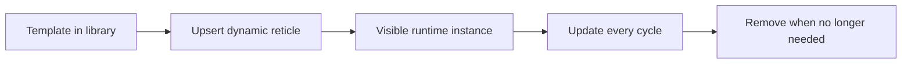

# Add And Remove Dynamic Reticles

This tutorial shows how to create, update, and remove dynamic reticles from a
client application.

## At A Glance



Dynamic reticles are ideal for:

- radar detections
- tracks
- route points
- temporary symbols

## Step 1 - Prepare one reusable template

The client creates dynamic reticles from a template id.

For example, the project already provides `radar_track` in
`assets/reticles/radar_track.json`.

## Step 2 - Upsert one dynamic reticle

`Upsert` means:

- create it if it does not exist
- update it if it already exists

```cpp
mfd::ReticlePatch patch;
patch.visible = true;
patch.blinkEnabled = true;
patch.blinkType = std::string {"fast"};
patch.position = mfd::Vec2 {0.25f, 0.10f};
patch.rotationDegrees = 15.0f;
patch.color = mfd::ColorRgba {77, 224, 255, 255};
patch.thickness = 0.004f;
patch.text = std::string {"T42"};

client.UpsertDynamicReticle("Radar", "track_42", "radar_track", patch);
```

## Step 3 - Update many dynamic reticles in bulk

This is the preferred approach for high-rate radar style traffic:

```cpp
std::vector<mfd::DynamicReticleState> updates;

updates.push_back({
    "track_001",
    mfd::ReticlePatch {
        .visible = true,
        .blinkEnabled = true,
        .blinkType = std::string {"fast"},
        .position = mfd::Vec2 {0.20f, 0.35f},
        .rotationDegrees = 15.0f,
        .color = mfd::ColorRgba {77, 224, 255, 255},
        .text = std::string {"AF001"}
    }});

updates.push_back({
    "track_002",
    mfd::ReticlePatch {
        .visible = true,
        .blinkEnabled = true,
        .blinkType = std::string {"caution"},
        .position = mfd::Vec2 {-0.40f, 0.10f},
        .rotationDegrees = -30.0f,
        .color = mfd::ColorRgba {255, 191, 0, 255},
        .text = std::string {"AF002"}
    }});

client.UpsertDynamicReticles("Radar", "radar_track", updates);
```

`CommandClient` automatically splits oversized UDP payloads when needed.

If the target page declares several blink types with the same effective
duration, those dynamic reticles blink in phase automatically.

## Step 4 - Declutter one full dynamic template set

When your generated UI exposes one dynamic set (for example `tracks`), you can
toggle all its children at once:

```cpp
auto& tracks = ui.Radar().Dynamic("radar_track");
tracks.SetVisible(false); // hides every dynamic reticle created from radar_track
```

The runtime keeps dynamic instances alive and masks rendering until visibility
is enabled again.

At the low-level API, this maps to:

```cpp
client.SetDynamicReticleSetVisible("Radar", "radar_track", false);
```

## Step 5 - Remove one dynamic reticle

```cpp
client.RemoveDynamicReticle("Radar", "track_42");
```

## Step 6 - Remove reticles that disappeared from your source

Typical pattern:

1. collect current ids from your external source
2. upsert current ids
3. remove ids that existed in the previous cycle but not in the current one

This is the standard radar-track lifecycle.

## Step 7 - Important naming rule

A dynamic reticle is uniquely addressed by:

- page name
- reticle id

Example:

- page: `Radar`
- reticle id: `track_042`

## What You Should See

When the client upserts a new dynamic reticle:

- the symbol appears on the selected page
- later updates move or recolor the same symbol
- removing it makes it disappear cleanly

If the symbol does not appear, check:

- the page name
- the dynamic reticle id
- the template id
- whether the selected page is active

## Result

You now know how to:

- create dynamic reticles
- update them every cycle
- declutter one full dynamic template set
- remove them cleanly
