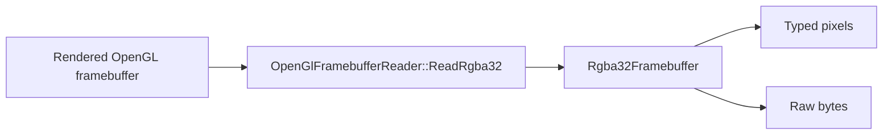

# Capture The Window As RGBA32

This tutorial shows how to capture the rendered window as a CPU buffer using
the OpenGL readback API.

## At A Glance



The project exposes a typed `RGBA32` buffer:

- 4 channels
- 8 bits per channel
- one `Rgba8Pixel` per pixel

Internally the helper relies on the underlying OpenGL framebuffer readback
path.

## Step 1 - Include the API

```cpp
#include "mfd/render/OpenGlFramebufferReader.h"
```

## Step 2 - Capture the full framebuffer

```cpp
mfd::Rgba32Framebuffer capture = mfd::OpenGlFramebufferReader::ReadRgba32();
```

## Step 3 - Access typed pixels

```cpp
if (!capture.Empty())
{
    const mfd::Rgba8Pixel first = capture.Pixels().front();
}
```

## Step 4 - Access raw bytes

```cpp
mfd::ByteView raw = capture.Bytes();
```

This is useful when another system expects a generic byte buffer, for example:

- shared memory
- an IPC channel
- a recording pipeline
- a foreign image-processing API

## Step 5 - Capture only a sub-rectangle

```cpp
mfd::FramebufferCaptureRequest request;
request.x = 100;
request.y = 80;
request.width = 480;
request.height = 480;
request.origin = mfd::FramebufferOrigin::TopLeft;

mfd::Rgba32Framebuffer capture = mfd::OpenGlFramebufferReader::ReadRgba32(request);
```

## Step 6 - Understand the output layout

The returned object contains:

- `width`
- `height`
- `pixels`
- `Pixels()`
- `Bytes()`

The buffer is stored row by row.

## Step 7 - Typical use cases

Common use cases are:

- picture-in-picture rendering
- export to an external image consumer
- recording
- image-based integration tests
- shared processing pipelines after readback

## Step 8 - Forward frames directly from `RunLauncher`

If you are using the generic launcher, you can forward the final `RGBA32`
window buffer every frame through the optional launcher callback:

```cpp
#include <cstddef>
#include <iostream>

#include "mfd/window/WindowLauncher.h"

int main(int argc, char** argv)
{
    mfd::window::LauncherConfig config;
    config.applicationName = "mfd_demo_minimal";
    config.defaultWindowFile = "assets/windows/demo_pages_minimal.json";

    return mfd::window::RunLauncher(
        argc,
        argv,
        config,
        [](int width, int height, mfd::ByteView pixels)
        {
            static bool printed = false;
            if (!printed)
            {
                std::cout << "Here we receive the pixel buffer." << '\n';
                printed = true;
            }

            (void)width;
            (void)height;
            (void)pixels;
        });
}
```

The callback receives:

- `width`
- `height`
- `mfd::ByteView` over the same `RGBA32` data

When the runtime is hosted on a compatible desktop OpenGL backend, the launcher
tries to keep this callback fed from an asynchronous PBO readback path. If the
required entry points are not available, it falls back to the synchronous
`OpenGlFramebufferReader` path automatically.

Copy the byte span inside the callback if another system needs to keep it after
the function returns.

## What You Should Get

After a capture:

- `width` and `height` match the requested area
- `Pixels()` gives typed `Rgba8Pixel` access
- `Bytes()` gives a raw `std::byte` view over the same buffer

This is the right API when another system wants raw `RGBA32` pixel buffers.

## Result

You now know how to pull an `RGBA32` framebuffer buffer from the window using
the public API, either directly through `OpenGlFramebufferReader` or through
the optional `RunLauncher` callback.
